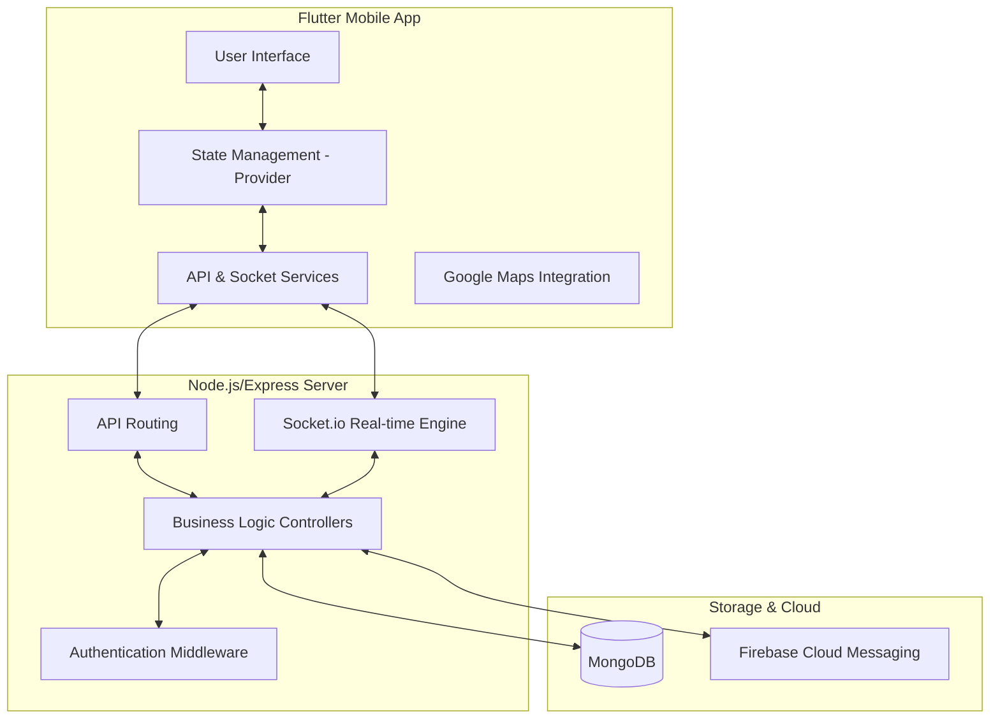

# Project Architecture

The College Bus Tracking System follows a modern client-server architecture with real-time capabilities.

## High-Level Architecture

## Communication Flows

1.  **REST API (HTTP/Dio)**: Used for standard request-response actions such as user login, registration, and profile management.
2.  **WebSocket (Socket.io)**: Facilitates real-time bus location updates from driver to students/teachers.
3.  **Firebase Cloud Messaging (FCM)**: Handles push notifications for alerts, reminders, and updates.
4.  **Database (Mongoose)**: Manages persistent data including user profiles, bus routes, and schedules.
