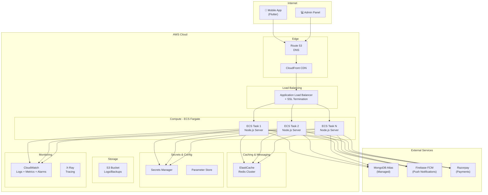

# AWS Deployment Analysis: College Bus Tracking Server

> **Generated:** 2026-02-09  
> **Project:** college-bus-tracking-server  
> **Version:** 1.0.0

---

## 📋 Executive Summary

This document provides a comprehensive analysis of the Node.js server for AWS deployment with 24/7 uptime and automatic scaling. The server is a **TypeScript-based Express.js application** with real-time Socket.io communication, MongoDB database, Redis for Socket.io adapter, and Firebase for push notifications.

---

## 1. Dependencies and Environment

### 1.1 Node.js Version Required

| Requirement | Version                          | Notes                                           |
| ----------- | -------------------------------- | ----------------------------------------------- |
| **Node.js** | ≥18.x LTS (recommended 20.x LTS) | TypeScript target: ES2016; uses modern features |
| **npm**     | ≥9.x                             | Lock file version: package-lock.json v3         |

> [!IMPORTANT]
> The `tsconfig.json` targets ES2016. For best AWS Lambda/ECS compatibility, use **Node.js 20.x LTS**.

### 1.2 Production Dependencies

| Package                    | Version  | Purpose                             | Native Deps                   |
| -------------------------- | -------- | ----------------------------------- | ----------------------------- |
| `express`                  | ^4.18.2  | HTTP server framework               | ❌                            |
| `socket.io`                | ^4.8.3   | Real-time WebSocket communication   | ❌                            |
| `@socket.io/redis-adapter` | ^8.3.0   | Redis adapter for Socket.io scaling | ❌                            |
| `mongoose`                 | ^8.0.3   | MongoDB ODM                         | ❌                            |
| `redis`                    | ^5.10.0  | Redis client for pub/sub            | ❌                            |
| `firebase-admin`           | ^13.6.0  | Push notifications (FCM)            | ❌ (has native optional deps) |
| `bcryptjs`                 | ^3.0.3   | Password hashing                    | ❌ (pure JS)                  |
| `jsonwebtoken`             | ^9.0.3   | JWT authentication                  | ❌                            |
| `dotenv`                   | ^16.3.1  | Environment configuration           | ❌                            |
| `cors`                     | ^2.8.5   | Cross-origin resource sharing       | ❌                            |
| `express-rate-limit`       | ^8.2.1   | API rate limiting                   | ❌                            |
| `rate-limiter-flexible`    | ^9.0.1   | Flexible rate limiting              | ❌                            |
| `razorpay`                 | ^2.9.6   | Payment gateway integration         | ❌                            |
| `lru-cache`                | ^11.2.4  | In-memory caching                   | ❌                            |
| `nodemailer`               | ^7.0.12  | Email sending                       | ❌                            |
| `googleapis`               | ^169.0.0 | Google APIs (OAuth)                 | ❌                            |
| `winston`                  | ^3.19.0  | Logging framework                   | ❌                            |
| `zod`                      | ^4.3.6   | Schema validation                   | ❌                            |

> [!NOTE]
> All dependencies are pure JavaScript with no native C++ bindings. This simplifies Docker builds across different architectures.

### 1.3 DevDependencies (Build-time only)

- `typescript` ^5.9.3
- `ts-node` ^10.9.2
- `jest` ^29.7.0 / `ts-jest` ^29.1.1
- Type definitions for Express, Node, JWT, Socket.io, etc.

### 1.4 Environment Variables Required

| Variable                | Description                       | Sensitivity |
| ----------------------- | --------------------------------- | ----------- |
| `PORT`                  | Server port (default: 5000)       | Low         |
| `MONGO_URI`             | MongoDB Atlas connection string   | 🔐 High     |
| `REDIS_URL`             | Redis connection URL              | 🔐 High     |
| `JWT_SECRET`            | JWT signing secret                | 🔐 Critical |
| `FIREBASE_PROJECT_ID`   | Firebase project ID               | Medium      |
| `FIREBASE_CLIENT_EMAIL` | Firebase service account email    | Medium      |
| `FIREBASE_PRIVATE_KEY`  | Firebase private key (PEM format) | 🔐 Critical |
| `GOOGLE_CLIENT_ID`      | Google OAuth client ID            | Medium      |
| `GOOGLE_CLIENT_SECRET`  | Google OAuth client secret        | 🔐 High     |
| `GOOGLE_REFRESH_TOKEN`  | Google OAuth refresh token        | 🔐 High     |
| `REDIRECT_URI`          | OAuth redirect URI                | Low         |
| `RAZORPAY_KEY_ID`       | Razorpay API key ID               | Medium      |
| `RAZORPAY_KEY_SECRET`   | Razorpay API secret               | 🔐 High     |
| `EMAIL_USER`            | Email sender address              | Medium      |

---

## 2. Architecture and AWS Services

### 2.1 Recommended AWS Architecture



### 2.2 AWS Services Breakdown

| Service                       | Purpose                     | Why Chosen                                                    |
| ----------------------------- | --------------------------- | ------------------------------------------------------------- |
| **ECS Fargate**               | Container orchestration     | Serverless containers, no server management, auto-scaling     |
| **Application Load Balancer** | Traffic distribution + SSL  | WebSocket (Socket.io) support, health checks, sticky sessions |
| **ElastiCache (Redis)**       | Socket.io adapter + caching | Required for multi-instance Socket.io, low latency            |
| **MongoDB Atlas**             | Database (already in use)   | Keep existing, peered VPC connection                          |
| **Route 53**                  | DNS management              | Low latency routing, health checks                            |
| **CloudFront**                | CDN + DDoS protection       | Edge caching, WAF integration                                 |
| **Secrets Manager**           | Credentials storage         | Automatic rotation, secure access                             |
| **CloudWatch**                | Monitoring + alerting       | Unified logging, metrics, alarms                              |
| **ECR**                       | Docker image registry       | Private, integrated with ECS                                  |
| **S3**                        | Log storage, backups        | Durable, lifecycle policies                                   |

> [!WARNING]
> **Lambda is NOT recommended** for this application because:
>
> - Socket.io requires persistent WebSocket connections
> - Real-time bus tracking needs low-latency responses
> - Firebase write-behind buffer requires persistent state

### 2.3 Horizontal Scaling Architecture

The application is **already designed for horizontal scaling**:

| Feature                 | Current Implementation        | AWS Strategy                                 |
| ----------------------- | ----------------------------- | -------------------------------------------- |
| Socket.io Redis Adapter | ✅ `@socket.io/redis-adapter` | ElastiCache Redis cluster                    |
| Stateless REST API      | ✅ No session storage         | ECS auto-scaling                             |
| Write-behind Buffer     | ⚠️ In-memory (per instance)   | Convert to Redis-based shared buffer         |
| Rate Limiting           | ✅ `rate-limiter-flexible`    | Can use Redis store for distributed limiting |

**Scaling Modifications Required:**

1. **Location Buffer** (`socket.ts` lines 39-69): Currently uses in-memory `Map`. For horizontal scaling, migrate to Redis-based buffer.

```typescript
// Current (in-memory, single instance only):
const locationBuffer = new Map<string, BufferedLocation>();

// Recommended (Redis, multi-instance):
// Use Redis HSET with expiry for distributed buffer
```

---

## 3. Deployment Requirements

### 3.1 Dockerization

Create a multi-stage Dockerfile for optimal image size:

```dockerfile
# ===== Stage 1: Build =====
FROM node:20-alpine AS builder

WORKDIR /app

# Install dependencies
COPY package*.json ./
RUN npm ci --only=production=false

# Copy source and build
COPY tsconfig.json ./
COPY src ./src
RUN npm run build

# ===== Stage 2: Production =====
FROM node:20-alpine AS production

# Security: Don't run as root
RUN addgroup -g 1001 -S nodejs && \
    adduser -S nodejs -u 1001

WORKDIR /app

# Copy production dependencies
COPY package*.json ./
RUN npm ci --only=production && npm cache clean --force

# Copy compiled JavaScript
COPY --from=builder /app/dist ./dist

# Set ownership
RUN chown -R nodejs:nodejs /app
USER nodejs

# Health check endpoint exists at /ping
HEALTHCHECK --interval=30s --timeout=3s --start-period=10s --retries=3 \
  CMD wget --no-verbose --tries=1 --spider http://localhost:5000/ping || exit 1

EXPOSE 5000

CMD ["node", "dist/index.js"]
```

### 3.2 Docker Compose (Local Development)

```yaml
version: "3.8"
services:
  server:
    build: .
    ports:
      - "5000:5000"
    environment:
      - NODE_ENV=production
      - PORT=5000
    env_file:
      - .env.production
    depends_on:
      - redis
    restart: unless-stopped

  redis:
    image: redis:7-alpine
    ports:
      - "6379:6379"
    volumes:
      - redis-data:/data
    restart: unless-stopped

volumes:
  redis-data:
```

### 3.3 ECS Task Definition

```json
{
  "family": "bus-tracking-server",
  "networkMode": "awsvpc",
  "requiresCompatibilities": ["FARGATE"],
  "cpu": "512",
  "memory": "1024",
  "executionRoleArn": "arn:aws:iam::ACCOUNT:role/ecsTaskExecutionRole",
  "taskRoleArn": "arn:aws:iam::ACCOUNT:role/busTrackingTaskRole",
  "containerDefinitions": [
    {
      "name": "bus-tracking-server",
      "image": "ACCOUNT.dkr.ecr.REGION.amazonaws.com/bus-tracking:latest",
      "portMappings": [
        {
          "containerPort": 5000,
          "protocol": "tcp"
        }
      ],
      "healthCheck": {
        "command": [
          "CMD-SHELL",
          "wget --no-verbose --tries=1 --spider http://localhost:5000/ping || exit 1"
        ],
        "interval": 30,
        "timeout": 5,
        "retries": 3,
        "startPeriod": 60
      },
      "logConfiguration": {
        "logDriver": "awslogs",
        "options": {
          "awslogs-group": "/ecs/bus-tracking-server",
          "awslogs-region": "ap-south-1",
          "awslogs-stream-prefix": "ecs"
        }
      },
      "secrets": [
        {
          "name": "MONGO_URI",
          "valueFrom": "arn:aws:secretsmanager:REGION:ACCOUNT:secret:bus-tracking/mongodb"
        },
        {
          "name": "JWT_SECRET",
          "valueFrom": "arn:aws:secretsmanager:REGION:ACCOUNT:secret:bus-tracking/jwt"
        },
        {
          "name": "FIREBASE_PRIVATE_KEY",
          "valueFrom": "arn:aws:secretsmanager:REGION:ACCOUNT:secret:bus-tracking/firebase"
        },
        {
          "name": "RAZORPAY_KEY_SECRET",
          "valueFrom": "arn:aws:secretsmanager:REGION:ACCOUNT:secret:bus-tracking/razorpay"
        }
      ],
      "environment": [
        { "name": "PORT", "value": "5000" },
        { "name": "NODE_ENV", "value": "production" }
      ]
    }
  ]
}
```

### 3.4 CI/CD Pipeline (GitHub Actions)

```yaml
name: Deploy to AWS ECS

on:
  push:
    branches: [main]
    paths:
      - "server/**"

env:
  AWS_REGION: ap-south-1
  ECR_REPOSITORY: bus-tracking
  ECS_SERVICE: bus-tracking-service
  ECS_CLUSTER: bus-tracking-cluster
  CONTAINER_NAME: bus-tracking-server

jobs:
  deploy:
    runs-on: ubuntu-latest

    steps:
      - uses: actions/checkout@v4

      - name: Configure AWS credentials
        uses: aws-actions/configure-aws-credentials@v4
        with:
          aws-access-key-id: ${{ secrets.AWS_ACCESS_KEY_ID }}
          aws-secret-access-key: ${{ secrets.AWS_SECRET_ACCESS_KEY }}
          aws-region: ${{ env.AWS_REGION }}

      - name: Login to Amazon ECR
        id: login-ecr
        uses: aws-actions/amazon-ecr-login@v2

      - name: Build, tag, and push Docker image
        id: build-image
        working-directory: ./server
        env:
          ECR_REGISTRY: ${{ steps.login-ecr.outputs.registry }}
          IMAGE_TAG: ${{ github.sha }}
        run: |
          docker build -t $ECR_REGISTRY/$ECR_REPOSITORY:$IMAGE_TAG -t $ECR_REGISTRY/$ECR_REPOSITORY:latest .
          docker push $ECR_REGISTRY/$ECR_REPOSITORY:$IMAGE_TAG
          docker push $ECR_REGISTRY/$ECR_REPOSITORY:latest
          echo "image=$ECR_REGISTRY/$ECR_REPOSITORY:$IMAGE_TAG" >> $GITHUB_OUTPUT

      - name: Update ECS service
        run: |
          aws ecs update-service --cluster $ECS_CLUSTER --service $ECS_SERVICE --force-new-deployment
```

---

## 4. Scaling and High Availability

### 4.1 Load Balancing Strategy

| Configuration             | Value                           | Rationale                               |
| ------------------------- | ------------------------------- | --------------------------------------- |
| **Type**                  | Application Load Balancer (ALB) | WebSocket support required              |
| **Target Type**           | IP (for Fargate)                | awsvpc network mode                     |
| **Stickiness**            | Enabled (1 hour)                | Socket.io requires same instance        |
| **Health Check Path**     | `/ping`                         | Already implemented                     |
| **Health Check Interval** | 30s                             | Balance between responsiveness and cost |
| **Deregistration Delay**  | 120s                            | Allow WebSocket graceful disconnect     |

**ALB Listener Rules:**

1. HTTPS:443 → Target Group (Forward)
2. HTTP:80 → HTTPS:443 (Redirect)
3. WebSocket upgrade handled automatically

### 4.2 Auto-Scaling Configuration

```yaml
# ECS Service Auto Scaling
ScalingPolicies:
  # CPU-based scaling
  - PolicyName: CPUTargetTracking
    PolicyType: TargetTrackingScaling
    TargetTrackingScalingPolicyConfiguration:
      PredefinedMetricSpecification:
        PredefinedMetricType: ECSServiceAverageCPUUtilization
      TargetValue: 70.0
      ScaleInCooldown: 300
      ScaleOutCooldown: 60

  # Memory-based scaling
  - PolicyName: MemoryTargetTracking
    PolicyType: TargetTrackingScaling
    TargetTrackingScalingPolicyConfiguration:
      PredefinedMetricSpecification:
        PredefinedMetricType: ECSServiceAverageMemoryUtilization
      TargetValue: 75.0
      ScaleInCooldown: 300
      ScaleOutCooldown: 60

  # Request count scaling (for Socket.io connections)
  - PolicyName: RequestCountScaling
    PolicyType: TargetTrackingScaling
    TargetTrackingScalingPolicyConfiguration:
      PredefinedMetricSpecification:
        PredefinedMetricType: ALBRequestCountPerTarget
      TargetValue: 1000
      ScaleInCooldown: 300
      ScaleOutCooldown: 60

# Capacity limits
MinCapacity: 2 # High availability minimum
MaxCapacity: 10 # Cost control maximum
DesiredCapacity: 2
```

### 4.3 High Availability Design

| Component         | HA Strategy                      |
| ----------------- | -------------------------------- |
| ECS Tasks         | Minimum 2 tasks across 2 AZs     |
| ALB               | Multi-AZ by default              |
| ElastiCache Redis | Multi-AZ with automatic failover |
| MongoDB Atlas     | Already multi-AZ (M10+ cluster)  |
| Route 53          | Global, 100% SLA                 |

### 4.4 Logging, Monitoring, and Alerting

**CloudWatch Log Groups:**

- `/ecs/bus-tracking-server` - Application logs (Winston)
- `/aws/alb/bus-tracking` - ALB access logs
- `/aws/elasticache/redis` - Redis logs

**CloudWatch Metrics & Alarms:**

| Metric                    | Threshold       | Action                  |
| ------------------------- | --------------- | ----------------------- |
| ECS CPU Utilization       | > 80% for 5 min | SNS Alert + Scale Out   |
| ECS Memory Utilization    | > 85% for 5 min | SNS Alert + Scale Out   |
| ALB 5XX Errors            | > 10/min        | SNS Critical Alert      |
| ALB Target Response Time  | > 2s avg        | SNS Warning             |
| ElastiCache CPU           | > 70%           | SNS Alert               |
| MongoDB Atlas Connections | > 80% of limit  | Email Alert (via Atlas) |

**Winston Logger Configuration (already in place):**

```typescript
// src/utils/logger.ts - Already configured for CloudWatch compatibility
// Logs are JSON-formatted for CloudWatch Insights queries
```

---

## 5. Security Recommendations

### 5.1 IAM Roles and Permissions

**ECS Task Execution Role:**

```json
{
  "Version": "2012-10-17",
  "Statement": [
    {
      "Effect": "Allow",
      "Action": [
        "ecr:GetAuthorizationToken",
        "ecr:BatchCheckLayerAvailability",
        "ecr:GetDownloadUrlForLayer",
        "ecr:BatchGetImage"
      ],
      "Resource": "*"
    },
    {
      "Effect": "Allow",
      "Action": ["logs:CreateLogStream", "logs:PutLogEvents"],
      "Resource": "arn:aws:logs:*:*:log-group:/ecs/bus-tracking-server:*"
    },
    {
      "Effect": "Allow",
      "Action": ["secretsmanager:GetSecretValue"],
      "Resource": "arn:aws:secretsmanager:*:*:secret:bus-tracking/*"
    }
  ]
}
```

**ECS Task Role (application permissions):**

```json
{
  "Version": "2012-10-17",
  "Statement": [
    {
      "Effect": "Allow",
      "Action": ["s3:PutObject", "s3:GetObject"],
      "Resource": "arn:aws:s3:::bus-tracking-logs/*"
    }
  ]
}
```

### 5.2 Secrets Management

| Secret                 | Storage             | Rotation                            |
| ---------------------- | ------------------- | ----------------------------------- |
| `MONGO_URI`            | AWS Secrets Manager | Manual (Atlas credentials)          |
| `JWT_SECRET`           | AWS Secrets Manager | Manual (coordinate with mobile app) |
| `FIREBASE_PRIVATE_KEY` | AWS Secrets Manager | Manual (Firebase Console)           |
| `RAZORPAY_KEY_SECRET`  | AWS Secrets Manager | Manual (Razorpay Dashboard)         |
| `GOOGLE_REFRESH_TOKEN` | AWS Secrets Manager | Auto-refresh in code                |
| `REDIS_URL`            | Parameter Store     | Manual                              |

> [!CAUTION]
> The current `.env` file contains **PRODUCTION SECRETS** committed to the repository.
> **Immediate action required:**
>
> 1. Rotate ALL secrets (MongoDB, Firebase, Razorpay, JWT)
> 2. Remove `.env` from git history using `git filter-branch` or BFG Repo Cleaner
> 3. Add `.env` to `.gitignore` (already present, but file was committed)

### 5.3 Network Security

**VPC Configuration:**

- Private subnets for ECS tasks
- Public subnets for ALB only
- NAT Gateway for outbound internet (Firebase, Razorpay APIs)
- VPC Peering with MongoDB Atlas

**Security Groups:**

| SG Name  | Inbound                | Outbound                     |
| -------- | ---------------------- | ---------------------------- |
| ALB-SG   | 80, 443 from 0.0.0.0/0 | All to ECS-SG                |
| ECS-SG   | 5000 from ALB-SG       | All to 0.0.0.0/0 (API calls) |
| Redis-SG | 6379 from ECS-SG       | None                         |

---

## 6. Performance Considerations

### 6.1 Node.js Optimization

| Optimization           | Current Status            | Recommendation                          |
| ---------------------- | ------------------------- | --------------------------------------- |
| **Clustering**         | ❌ Single process         | Use Node.js cluster or PM2 in container |
| **Connection Pooling** | ✅ Mongoose default (100) | Tune for expected load                  |
| **Keep-Alive**         | ❌ Not configured         | Enable HTTP Keep-Alive                  |
| **Compression**        | ❌ Not enabled            | Add `compression` middleware            |
| **Helmet Security**    | ❌ Not installed          | Add `helmet` for security headers       |

**Recommended code additions:**

```typescript
// Add to src/index.ts
import compression from "compression";
import helmet from "helmet";

app.use(helmet());
app.use(compression());
```

### 6.2 Database Connection Optimization

**Current MongoDB Settings:**

```typescript
// src/config/db.ts
mongoose.connect(MONGO_URI, {
  serverSelectionTimeoutMS: 5000, // Good for fast failover
});
```

**Recommended Production Settings:**

```typescript
mongoose.connect(MONGO_URI, {
  serverSelectionTimeoutMS: 5000,
  maxPoolSize: 50, // Tune based on ECS task count
  minPoolSize: 10, // Keep warm connections
  socketTimeoutMS: 45000, // Socket timeout
  connectTimeoutMS: 10000, // Initial connection timeout
  retryWrites: true,
  w: "majority", // Write concern
});
```

### 6.3 Caching Recommendations

| Data Type      | Current               | Recommended                     |
| -------------- | --------------------- | ------------------------------- |
| User sessions  | None                  | JWT (stateless) ✅              |
| Bus locations  | LRU Cache (in-memory) | Redis (shared across instances) |
| Route data     | None                  | Redis with 5-min TTL            |
| College config | None                  | Redis with 1-hour TTL           |

**LRU Cache is already used:** `lru-cache` is installed. Extend to use Redis for distributed caching.

---

## 7. Potential Issues Detected

### 7.1 Critical Issues

| Issue                            | File           | Severity | Fix                                         |
| -------------------------------- | -------------- | -------- | ------------------------------------------- |
| 🔴 **Secrets in .env committed** | `.env`         | CRITICAL | Rotate all secrets, remove from git history |
| 🔴 **In-memory location buffer** | `socket.ts:39` | HIGH     | Migrate to Redis for horizontal scaling     |
| 🟡 **CORS allows all origins**   | `index.ts:35`  | MEDIUM   | Restrict to mobile app and admin panel      |

### 7.2 Missing Production Files

| File                 | Purpose                  | Status                            |
| -------------------- | ------------------------ | --------------------------------- |
| `Dockerfile`         | Container build          | ❌ Missing - must create          |
| `docker-compose.yml` | Local dev                | ❌ Missing - recommended          |
| `.dockerignore`      | Exclude files from build | ❌ Missing - must create          |
| `healthcheck.js`     | Container health         | ❌ Missing (using /ping endpoint) |

### 7.3 Code Quality Observations

| Observation                   | Location             | Recommendation                  |
| ----------------------------- | -------------------- | ------------------------------- |
| `nodemon` in production deps  | `package.json:30`    | Move to devDependencies         |
| Console.log used with Winston | Multiple controllers | Use winston logger consistently |
| No graceful shutdown handler  | `index.ts`           | Add SIGTERM handler for ECS     |

**Graceful Shutdown (add to index.ts):**

```typescript
process.on("SIGTERM", async () => {
  logger.info("SIGTERM received. Starting graceful shutdown...");

  httpServer.close(() => {
    logger.info("HTTP server closed");
  });

  // Close database connections
  await mongoose.connection.close();
  logger.info("MongoDB connection closed");

  // Close Redis connections
  await pubClient.quit();
  await subClient.quit();
  logger.info("Redis connections closed");

  process.exit(0);
});
```

---

## 8. Step-by-Step Deployment Plan

### Phase 1: Preparation (1-2 days)

- [ ] 1.1 Create AWS account (if not exists) and enable MFA
- [ ] 1.2 Set up VPC with public/private subnets in 2 AZs
- [ ] 1.3 Create IAM roles (ECS Task Execution, ECS Task)
- [ ] 1.4 Store secrets in AWS Secrets Manager
- [ ] 1.5 **ROTATE ALL SECRETS** (MongoDB, Firebase, Razorpay, JWT)
- [ ] 1.6 Set up VPC peering with MongoDB Atlas

### Phase 2: Containerization (1 day)

- [ ] 2.1 Create `Dockerfile` (provided above)
- [ ] 2.2 Create `.dockerignore`
- [ ] 2.3 Test Docker build locally
- [ ] 2.4 Move `nodemon` to devDependencies
- [ ] 2.5 Add graceful shutdown handler
- [ ] 2.6 Create ECR repository

### Phase 3: Infrastructure Setup (1-2 days)

- [ ] 3.1 Create ElastiCache Redis cluster (Multi-AZ)
- [ ] 3.2 Create ECS Cluster (Fargate)
- [ ] 3.3 Create Application Load Balancer
- [ ] 3.4 Configure ALB target group with health checks
- [ ] 3.5 Request/import SSL certificate in ACM
- [ ] 3.6 Configure CloudWatch Log Groups

### Phase 4: Deployment (1 day)

- [ ] 4.1 Push Docker image to ECR
- [ ] 4.2 Create ECS Task Definition
- [ ] 4.3 Create ECS Service with 2 tasks
- [ ] 4.4 Configure auto-scaling policies
- [ ] 4.5 Verify health checks passing
- [ ] 4.6 Test API endpoints

### Phase 5: DNS and CDN (0.5 days)

- [ ] 5.1 Create Route 53 hosted zone (if not exists)
- [ ] 5.2 Point domain to ALB
- [ ] 5.3 (Optional) Set up CloudFront distribution
- [ ] 5.4 Update mobile app API endpoints

### Phase 6: Monitoring & CI/CD (1 day)

- [ ] 6.1 Configure CloudWatch alarms
- [ ] 6.2 Set up SNS notifications
- [ ] 6.3 Create GitHub Actions workflow
- [ ] 6.4 Test auto-deployment on push

---

## 9. Estimated AWS Costs

| Service                   | Configuration             | Monthly Cost (USD) |
| ------------------------- | ------------------------- | ------------------ |
| ECS Fargate               | 2 x (0.5 vCPU, 1 GB)      | ~$30               |
| Application Load Balancer | 1 ALB + LCU               | ~$25               |
| ElastiCache Redis         | cache.t3.micro (Multi-AZ) | ~$25               |
| ECR                       | 5 GB storage              | ~$0.50             |
| CloudWatch                | Logs + Metrics            | ~$10               |
| Route 53                  | Hosted zone + queries     | ~$1                |
| Secrets Manager           | 5 secrets                 | ~$2.50             |
| NAT Gateway               | 1 per AZ (data transfer)  | ~$35               |
| **TOTAL**                 |                           | **~$130/month**    |

> [!TIP]
> MongoDB Atlas is separately billed. Current M10 cluster: ~$57/month.
> Redis Cloud (currently used): Check external billing.

---

## 10. What Next

### Immediate Actions (This Week)

1. **🔴 CRITICAL: Rotate all secrets** - The `.env` file contains production credentials that are committed to the repository. This is a severe security vulnerability.

2. **Create Dockerfile and containerize the application** - Use the Dockerfile template provided in Section 3.1 to build and test locally.

3. **Migrate location buffer to Redis** - The current in-memory buffer in `socket.ts` will not work with horizontal scaling. Implement a Redis-based shared buffer.

### Short-Term (Next 2 Weeks)

4. **Set up AWS infrastructure using the Phase 1-4 checklist** - Create VPC, ECS cluster, ALB, and ElastiCache.

5. **Implement CI/CD pipeline** - Use the GitHub Actions workflow provided in Section 3.4 for automated deployments.

6. **Add production optimizations** - Install `helmet` and `compression`, add graceful shutdown handler.

### Medium-Term (Next Month)

7. **Set up monitoring and alerting** - Configure CloudWatch alarms and SNS notifications for proactive issue detection.

8. **Load test the deployed infrastructure** - Use tools like k6 or Artillery to validate auto-scaling behavior.

9. **Document runbooks** - Create operational runbooks for common issues (scaling, deployment rollback, database issues).

---

> rule 7 is executed
