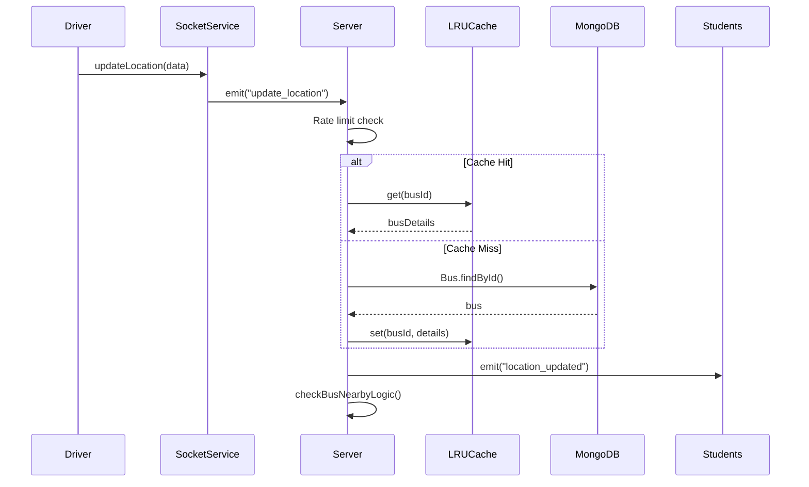
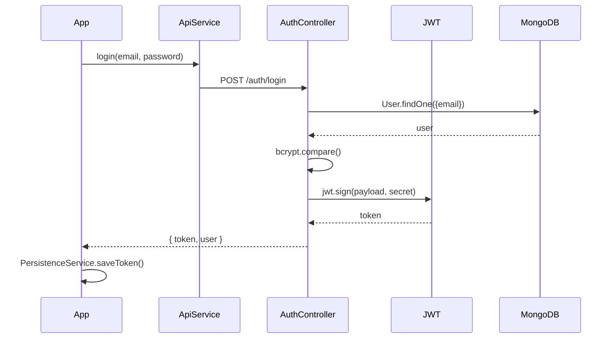

# Data Models Analysis

## Flutter Models

### UserModel

**Location**: `lib/models/user_model.dart`

| Field               | Type     | Required | Description                   |
| ------------------- | -------- | -------- | ----------------------------- |
| id                  | String   | ✅       | MongoDB ObjectId              |
| fullName            | String   | ✅       | User's full name              |
| email               | String   | ✅       | Email address                 |
| role                | UserRole | ✅       | User role enum                |
| collegeId           | String   | ✅       | Associated college ID         |
| approved            | bool     | ❌       | Account approval status       |
| emailVerified       | bool     | ❌       | Email verification status     |
| needsManualApproval | bool     | ❌       | Requires coordinator approval |
| phoneNumber         | String?  | ❌       | Optional phone                |
| rollNumber          | String?  | ❌       | Student roll number           |
| preferredStop       | String?  | ❌       | Preferred bus stop            |
| routeId             | String?  | ❌       | Selected route                |
| fcmToken            | String?  | ❌       | Firebase messaging token      |
| language            | String   | ❌       | Preferred language (en/hi/te) |

---

### BusModel

**Location**: `lib/models/bus_model.dart`

| Field           | Type              | Description                     |
| --------------- | ----------------- | ------------------------------- |
| id              | String            | Bus ID                          |
| busNumber       | String            | Bus registration/display number |
| collegeId       | String            | Parent college                  |
| driverId        | String?           | Assigned driver                 |
| routeId         | String?           | Assigned route                  |
| status          | String            | active/inactive/maintenance     |
| currentLocation | BusLocationModel? | Real-time location              |

---

### RouteModel

**Location**: `lib/models/route_model.dart`

| Field          | Type          | Description           |
| -------------- | ------------- | --------------------- |
| id             | String        | Route ID              |
| name           | String        | Route name            |
| collegeId      | String        | Parent college        |
| stops          | List<Stop>    | Ordered list of stops |
| polylinePoints | List<LatLng>? | Route path for map    |

---

### ScheduleModel

**Location**: `lib/models/schedule_model.dart`

| Field         | Type      | Description       |
| ------------- | --------- | ----------------- |
| id            | String    | Schedule ID       |
| busId         | String    | Associated bus    |
| routeId       | String    | Associated route  |
| departureTime | String    | Departure time    |
| arrivalTime   | String    | Arrival time      |
| daysOfWeek    | List<int> | Active days (1-7) |

---

## MongoDB Schemas

### User Schema (Most Complex)

```typescript
{
  _id: String,           // Custom string ID
  fullName: String,
  email: String,         // Sparse unique index
  password: String,      // bcrypt hashed
  otp: String,          // Email verification
  otpExpires: Date,
  role: Enum,           // 6 roles
  collegeId: ObjectId,  // Reference to College
  approved: Boolean,
  emailVerified: Boolean,
  needsManualApproval: Boolean,
  phoneNumber: String,
  rollNumber: String,
  preferredStop: String,
  fcmToken: String,
  language: Enum,       // en, hi, te
  routeId: ObjectId,    // Reference to Route
  stopId: String,
  stopName: String,
  stopLocation: { lat, lng },
  stopLocationGeo: {    // GeoJSON Point
    type: "Point",
    coordinates: [lng, lat]
  },
  lastNearbyNotifiedBusId: String
}
```

**Indexes**:

- `stopLocationGeo: "2dsphere"` (sparse) - for geospatial queries
- `routeId: 1` - for route-based user queries

---

### Bus Schema

```typescript
{
  _id: ObjectId,
  busNumber: String,
  collegeId: ObjectId,   // ref: College
  driverId: String,      // ref: User
  routeId: ObjectId,     // ref: Route
  status: Enum,          // active, inactive, maintenance
  currentLocation: {
    lat: Number,
    lng: Number,
    updatedAt: Date
  },
  speed: Number,
  heading: Number
}
```

---

### Route Schema

```typescript
{
  _id: ObjectId,
  name: String,
  collegeId: ObjectId,
  stops: [{
    id: String,
    name: String,
    location: { lat, lng },
    order: Number,
    estimatedTime: String
  }],
  polylinePoints: [[lat, lng]],
  isActive: Boolean
}
```

---

## Data Flow Patterns

### Location Update Flow



### Authentication Flow



---

## Model Consistency

### Flutter ↔ Backend Alignment

| Field    | Flutter            | Backend       | Status               |
| -------- | ------------------ | ------------- | -------------------- |
| id       | `id`               | `_id`         | ✅ Mapped in fromMap |
| role     | `UserRole` enum    | string        | ✅ Converted         |
| dates    | `DateTime`         | `Date/String` | ✅ Parsed            |
| location | `BusLocationModel` | `{lat, lng}`  | ✅ Mapped            |

> [!NOTE]
> All models correctly handle the MongoDB `_id` → `id` transformation
