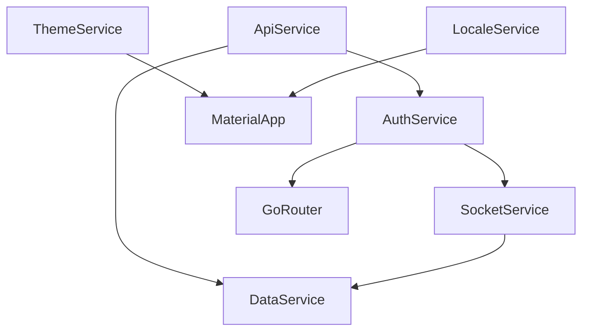
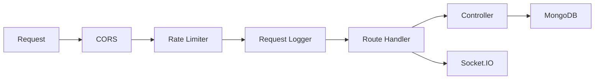
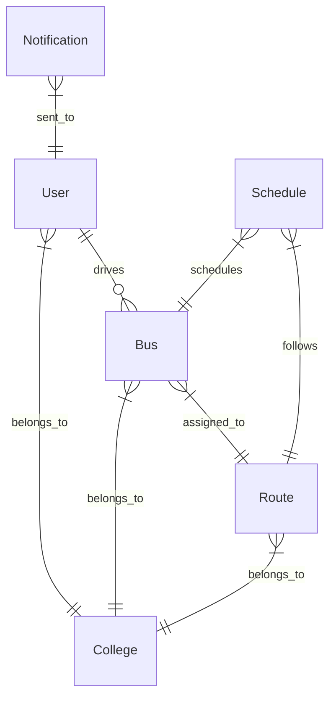

# Architecture Analysis

## Flutter Application Architecture

### Provider-Based State Management

The app uses a sophisticated **MultiProvider** setup with dependency injection:



#### Service Dependencies

1. **ApiService** - Standalone, no dependencies
2. **AuthService** - ChangeNotifierProxyProvider, depends on ApiService
3. **SocketService** - ChangeNotifierProxyProvider, depends on AuthService
4. **DataService** - ChangeNotifierProxyProvider2, depends on ApiService + SocketService
5. **GoRouter** - ProxyProvider, depends on AuthService for redirects

### Navigation Architecture

Uses **GoRouter** with:

- `refreshListenable` tied to AuthService for reactive auth state
- Role-based redirect logic
- Nested routes for role-specific dashboards
- Query parameter support for data passing

### Offline Support

The **SocketService** implements offline queuing:

1. Events queued when disconnected
2. Queue persisted to SharedPreferences
3. Automatic flush on reconnection
4. Throttled event replay (50ms delay)

---

## Backend Architecture

### Express Server Setup



### Key Components

#### 1. LRU Cache

```typescript
// Bus metadata cache - 500 entries, 30 min TTL
const busCache = new LRUCache<
  string,
  { busNumber: string; routeId: string | null }
>();
```

#### 2. Rate Limiting

- **API Level**: 100 requests/15 minutes per IP
- **Socket Level**: 10 updates/5 seconds per socket

#### 3. Socket.IO Authentication

- JWT token verified on connection
- User data attached to socket instance
- Room-based broadcasting per college

### Database Schema Design



#### Geospatial Features

- User model has `stopLocationGeo` with 2dsphere index
- Pre-save hook syncs `stopLocation` → `stopLocationGeo`
- Enables proximity-based queries for nearby notifications

---

## Communication Patterns

### 1. REST API (Dio → Express)

- Standard CRUD operations
- JWT token in Authorization header
- Centralized error handling with typed exceptions

### 2. Real-time Socket (Socket.IO)

- Event-driven location updates
- Room-based broadcasting (per college)
- Reconnection handling with state recovery

### 3. Push Notifications (FCM)

- Device-specific notifications
- Topic subscriptions
- High-priority Android/iOS configuration

---

## Code Quality Assessment

### Strengths ✅

| Aspect           | Implementation                                                               |
| ---------------- | ---------------------------------------------------------------------------- |
| Error Handling   | Custom exception types (`AppException`, `NetworkException`, `AuthException`) |
| Type Safety      | Strong typing in Dart models, TypeScript interfaces                          |
| State Management | Clean provider hierarchy with proper dependency injection                    |
| Offline Support  | Socket event queuing with persistence                                        |
| Security         | JWT auth, rate limiting, socket authentication                               |
| Logging          | Winston-based structured logging                                             |

### Areas for Improvement ⚠️

| Issue                | Recommendation                                         |
| -------------------- | ------------------------------------------------------ |
| Token Expiry         | 30-day JWT is long; consider refresh tokens            |
| Socket `user` typing | Use proper interface instead of `any`                  |
| Error Response       | Standardize error response format across all endpoints |
| Input Validation     | Add request body validation (e.g., Zod/Joi)            |
| Test Coverage        | Add unit and integration tests                         |
| Environment Config   | Centralize and validate env vars on startup            |
