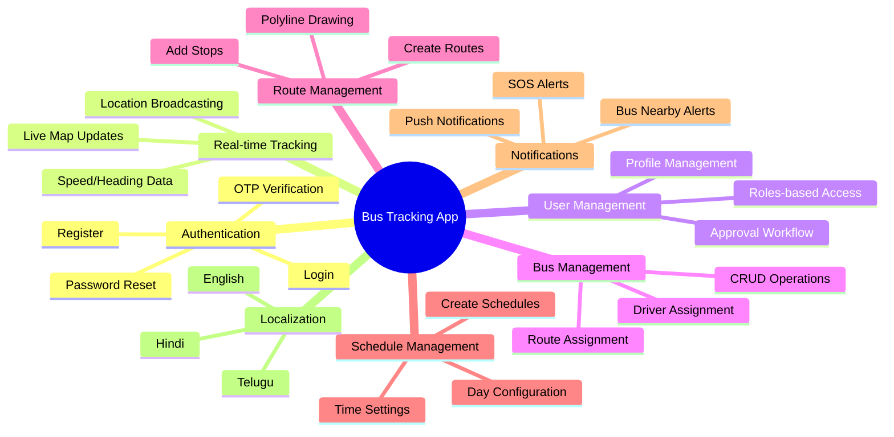
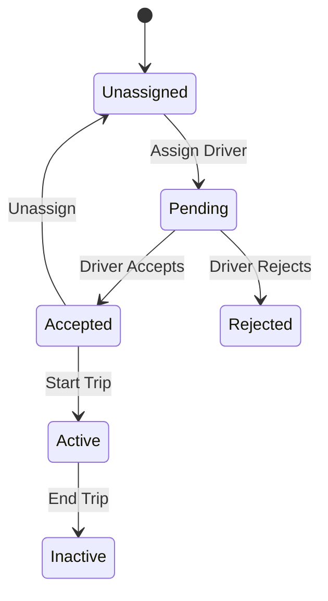

# Feature Analysis

## Core Features Overview



---

## Feature Details

### 1. Authentication System

| Feature          | Implementation | Status                  |
| ---------------- | -------------- | ----------------------- |
| Email Login      | ✅             | Complete                |
| Phone Login      | ✅             | Uses same field lookup  |
| Registration     | ✅             | Role-based registration |
| OTP Verification | ✅             | Email-based             |
| Password Reset   | ✅             | OTP + reset flow        |
| Remember Me      | ✅             | Token persistence       |

**Flow**:

1. User registers with email/phone
2. OTP sent to email (non-parent roles)
3. OTP verified → account active
4. Coordinator approval may be required
5. JWT issued on login (30-day expiry)

---

### 2. Real-time Location Tracking

| Feature             | Implementation | Status              |
| ------------------- | -------------- | ------------------- |
| GPS Location        | ✅             | Geolocator package  |
| Socket Broadcasting | ✅             | Socket.IO events    |
| Map Display         | ✅             | Google Maps Flutter |
| Speed Display       | ✅             | Included in updates |
| Heading Display     | ✅             | Compass direction   |
| Offline Queue       | ✅             | SharedPreferences   |

**Update Frequency**: Rate-limited to 10 updates per 5 seconds

---

### 3. Role-Based Dashboards

| Role        | Dashboard            | Key Features                        |
| ----------- | -------------------- | ----------------------------------- |
| Student     | StudentDashboard     | Map view, bus list, stop selection  |
| Teacher     | (Uses Student)       | Same as student                     |
| Parent      | (Uses Student)       | Same as student                     |
| Driver      | DriverDashboard      | Location sharing toggle, SOS button |
| Coordinator | CoordinatorDashboard | Bus/driver management, assignments  |
| Admin       | AdminDashboard       | Full system overview, approvals     |

---

### 4. Bus Management

**Coordinator Features**:

- Create/Edit/Delete buses
- Assign drivers to buses
- Assign routes to buses
- View assignment history
- Monitor bus status

**Assignment Workflow**:



---

### 5. Route Management

| Feature       | Description               |
| ------------- | ------------------------- |
| Create Route  | Name, college association |
| Add Stops     | Name, location, order     |
| Stop Ordering | Drag-and-drop ordering    |
| Polyline      | Visual route path on map  |
| Geofencing    | Stop proximity detection  |

---

### 6. Schedule Management

| Field           | Description |
| --------------- | ----------- |
| Bus Selection   | Which bus   |
| Route Selection | Which route |
| Departure Time  | Start time  |
| Arrival Time    | End time    |
| Days of Week    | Active days |

---

### 7. Notification System

| Type       | Trigger                 | Recipients              |
| ---------- | ----------------------- | ----------------------- |
| Bus Nearby | Bus within 500m of stop | Users with that stop    |
| SOS Alert  | Driver presses SOS      | Coordinators, all users |
| Assignment | Driver assigned         | Target driver           |
| Approval   | User approved           | Approved user           |

**FCM Configuration**:

- High priority for Android
- Default sound enabled
- Vibration patterns

---

### 8. Internationalization

| Language | Code | Coverage |
| -------- | ---- | -------- |
| English  | en   | 100%     |
| Hindi    | hi   | 100%     |
| Telugu   | te   | 100%     |

**Localization Structure**:

```
l10n/
├── auth/
│   ├── login/
│   └── signup/
├── student/
├── driver/
├── coordinator/
├── admin/
├── notification/
└── common/
```

---

### 9. SOS/Emergency System

**Driver SOS Flow**:

1. Driver presses SOS button
2. Location + busId sent to server
3. Notification to all coordinators
4. Incident logged

---

## Feature Comparison Matrix

| Feature            | Student | Teacher | Driver | Coordinator | Admin |
| ------------------ | ------- | ------- | ------ | ----------- | ----- |
| View Bus Locations | ✅      | ✅      | ❌     | ✅          | ✅    |
| View Schedules     | ✅      | ✅      | ✅     | ✅          | ✅    |
| Select Stop        | ✅      | ✅      | ❌     | ❌          | ❌    |
| Broadcast Location | ❌      | ❌      | ✅     | ❌          | ❌    |
| Manage Buses       | ❌      | ❌      | ❌     | ✅          | ✅    |
| Manage Routes      | ❌      | ❌      | ❌     | ✅          | ✅    |
| Manage Schedules   | ❌      | ❌      | ❌     | ✅          | ✅    |
| Approve Users      | ❌      | ❌      | ❌     | ✅          | ✅    |
| Send SOS           | ❌      | ❌      | ✅     | ❌          | ❌    |
| View All Users     | ❌      | ❌      | ❌     | ✅          | ✅    |
