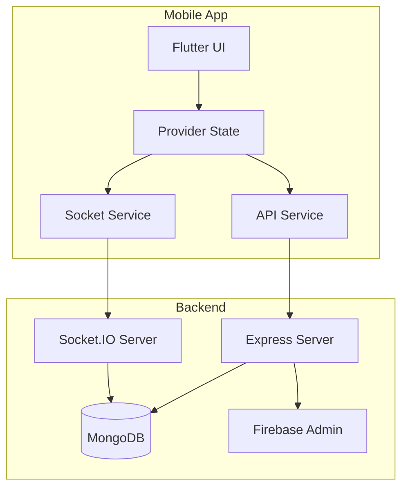

# College Bus Tracking App - Project Overview

## Executive Summary

A comprehensive **college bus tracking application** built with **Flutter** (mobile) and **Node.js/Express** (backend). The system enables real-time bus location tracking, route management, schedule management, and push notifications for students, teachers, drivers, and administrators.

## Technology Stack

### Mobile Application (Flutter)

| Category         | Technology                         |
| ---------------- | ---------------------------------- |
| Framework        | Flutter 3.8+                       |
| State Management | Provider                           |
| Navigation       | Go Router                          |
| Real-time        | Socket.IO Client                   |
| Maps             | Google Maps Flutter                |
| Notifications    | Firebase Messaging                 |
| HTTP Client      | Dio                                |
| Localization     | Flutter Localizations (EN, HI, TE) |
| Persistence      | Shared Preferences                 |

### Backend Server (Node.js)

| Category           | Technology                                 |
| ------------------ | ------------------------------------------ |
| Runtime            | Node.js + TypeScript                       |
| Framework          | Express.js                                 |
| Database           | MongoDB (Mongoose)                         |
| Real-time          | Socket.IO                                  |
| Authentication     | JWT                                        |
| Push Notifications | Firebase Admin SDK                         |
| Rate Limiting      | express-rate-limit + rate-limiter-flexible |
| Logging            | Winston                                    |
| Email              | Nodemailer                                 |

## Architecture Overview



## User Roles

| Role                | Description                             | Key Features                                   |
| ------------------- | --------------------------------------- | ---------------------------------------------- |
| **Student**         | Tracks buses, views schedules           | View bus locations, select stop, schedule view |
| **Teacher**         | Similar to student with enhanced access | View bus locations, schedule access            |
| **Parent**          | Monitors student's bus                  | Linked to student, simplified access           |
| **Driver**          | Broadcasts location                     | Start/end trip, location sharing, SOS          |
| **Bus Coordinator** | Manages buses and drivers               | Assign drivers, manage routes, schedules       |
| **Admin**           | Full system access                      | User management, approvals, college setup      |

## Project Structure

### Flutter App Structure

```
lib/
├── main.dart              # App entry, providers setup
├── auth/                  # Authentication screens (9 files)
├── models/                # Data models (8 files)
├── screens/               # UI screens by role (50 files)
│   ├── admin/
│   ├── common/
│   ├── coordinator/
│   ├── driver/
│   └── student/
├── services/              # Business logic (11 files)
├── utils/                 # Constants, router, helpers (4 files)
├── widgets/               # Reusable components (10 files)
└── l10n/                  # Localization (77 files)
```

### Server Structure

```
src/
├── index.ts               # Server entry, Socket.IO setup
├── config/                # Database config
├── constants/             # Application constants (13 files)
├── controllers/           # Request handlers (15 files)
│   └── auth/              # Auth controllers (5 files)
├── middleware/            # Express middleware
├── models/                # MongoDB schemas (9 files)
├── routes/                # API routes (11 files)
├── services/              # Business services
└── utils/                 # Helpers, Firebase, logger (9 files)
```

## Key Features

### 1. Real-time Location Tracking

- Live bus location updates via Socket.IO
- LRU cache for bus metadata (500 entries, 30min TTL)
- Rate limiting (10 updates/5 seconds per socket)

### 2. Authentication & Security

- JWT-based authentication (30-day expiry)
- OTP email verification
- Role-based access control
- Rate limiting on API endpoints (100 requests/15 min)

### 3. Notifications

- Firebase Cloud Messaging integration
- Push notifications for bus proximity
- Topic-based and device-specific notifications

### 4. Internationalization

- 3 languages: English, Hindi, Telugu
- Modular localization per feature area

## API Endpoints

| Category      | Endpoint Base        | Description                          |
| ------------- | -------------------- | ------------------------------------ |
| Auth          | `/api/auth`          | Login, register, OTP, password reset |
| Users         | `/api/users`         | User CRUD, profile management        |
| Buses         | `/api/buses`         | Bus management, location updates     |
| Routes        | `/api/routes`        | Route CRUD operations                |
| Schedules     | `/api/schedules`     | Schedule management                  |
| Notifications | `/api/notifications` | Push notification management         |
| Colleges      | `/api/colleges`      | College management                   |
| SOS           | `/api/sos`           | Emergency alerts                     |
| Incidents     | `/api/incidents`     | Incident reporting                   |

## Socket.IO Events

| Event                  | Direction       | Description                   |
| ---------------------- | --------------- | ----------------------------- |
| `join_college`         | Client → Server | Join college room for updates |
| `update_location`      | Client → Server | Driver broadcasts location    |
| `location_updated`     | Server → Client | Location broadcast to room    |
| `bus_list_updated`     | Bidirectional   | Bus list change notification  |
| `driver_status_update` | Server → Client | Driver online/offline status  |
