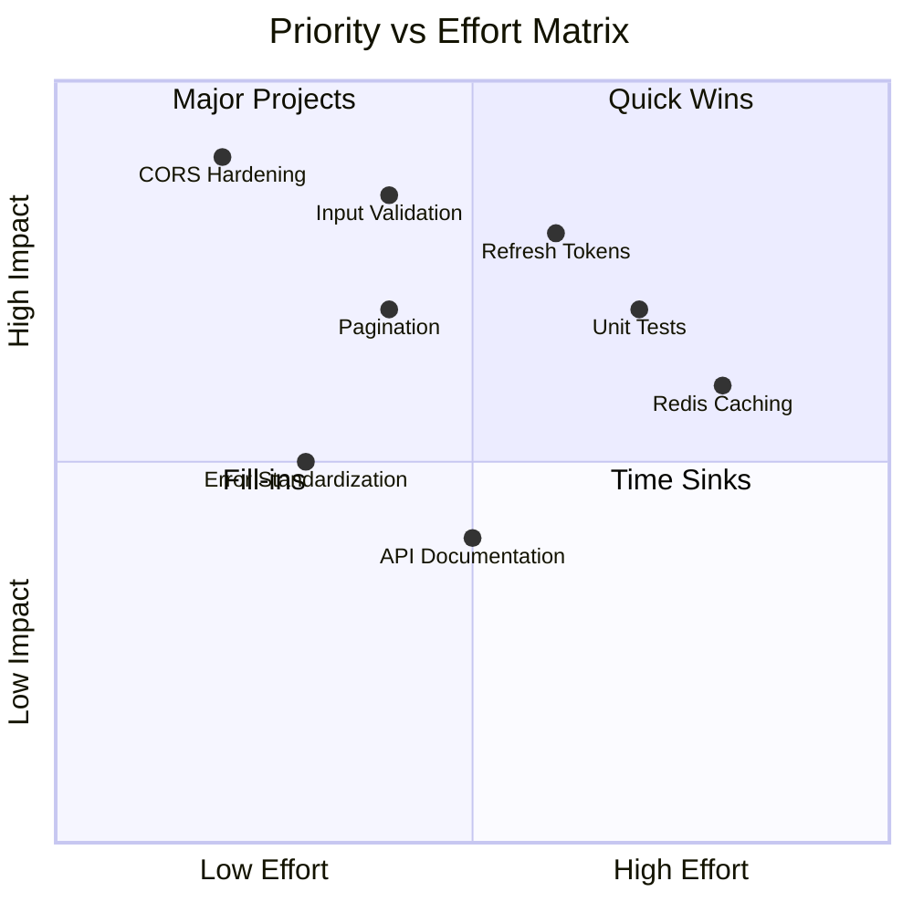
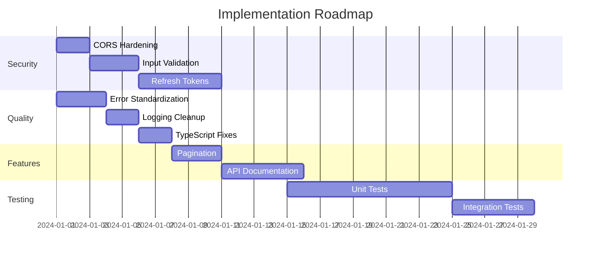

# Recommendations & Next Steps

## Priority Matrix



---

## Immediate Actions (P1) 🔴

### 1. Security Hardening

**CORS Configuration**:

```typescript
// Before (Too permissive)
cors({ origin: "*" });

// After (Production-ready)
cors({
  origin: process.env.ALLOWED_ORIGINS?.split(",") || [],
  credentials: true,
});
```

**Environment Variables**:
Add validation on startup:

```typescript
const requiredEnvVars = ["JWT_SECRET", "MONGODB_URI", "FIREBASE_PROJECT_ID"];
requiredEnvVars.forEach((v) => {
  if (!process.env[v]) throw new Error(`Missing ${v}`);
});
```

---

### 2. Input Validation

Add Zod schema validation:

```typescript
import { z } from "zod";

const loginSchema = z.object({
  email: z.string().email(),
  password: z.string().min(6),
});

// In controller
const { email, password } = loginSchema.parse(req.body);
```

---

### 3. Refresh Token Implementation

Current: Single 30-day JWT
Proposed: Access + Refresh token pattern

| Token   | Lifetime | Storage        |
| ------- | -------- | -------------- |
| Access  | 15 min   | Memory         |
| Refresh | 7 days   | Secure storage |

---

## Short-term Actions (P2) 🟡

### 4. Pagination for Lists

All list endpoints should support:

```
GET /api/users?page=1&limit=20&sortBy=createdAt&order=desc
```

Response:

```json
{
  "data": [...],
  "pagination": {
    "page": 1,
    "limit": 20,
    "total": 150,
    "pages": 8
  }
}
```

---

### 5. Error Response Standardization

```typescript
interface ErrorResponse {
  success: false;
  error: {
    code: string; // "AUTH_INVALID_TOKEN"
    message: string; // User-friendly message
    details?: any; // Validation errors, etc.
  };
  timestamp: string;
  requestId: string;
}
```

---

### 6. Logging Consistency

Replace all `console.log` with Winston:

```typescript
logger.info("Message", { userId, action });
logger.error("Error", { error, stack });
```

---

### 7. TypeScript Improvements

```typescript
// Replace any types
interface SocketUser {
  id: string;
  email: string;
  role: UserRole;
  collegeId: string;
  approved: boolean;
}

export interface AuthenticatedSocket extends Socket {
  user: SocketUser; // Not `any`
}
```

---

## Long-term Actions (P3) 🟢

### 8. Testing Strategy

| Type         | Tool          | Coverage Target |
| ------------ | ------------- | --------------- |
| Unit Tests   | Jest          | 80%             |
| Widget Tests | Flutter Test  | 60%             |
| Integration  | Supertest     | API endpoints   |
| E2E          | Maestro/Detox | Critical flows  |

---

### 9. API Documentation

Implement OpenAPI 3.0:

```yaml
openapi: 3.0.0
info:
  title: Bus Tracking API
  version: 1.0.0
paths:
  /api/auth/login:
    post:
      summary: User login
      ...
```

Tools: Swagger UI, Redoc

---

### 10. Performance Enhancements

| Enhancement           | Benefit               |
| --------------------- | --------------------- |
| Redis for sessions    | Reduced DB load       |
| CDN for static assets | Faster load times     |
| Connection pooling    | Better DB utilization |
| Response compression  | Smaller payloads      |

---

### 11. Monitoring & Observability

| Tool             | Purpose            |
| ---------------- | ------------------ |
| Sentry           | Error tracking     |
| Prometheus       | Metrics collection |
| Grafana          | Visualization      |
| Health endpoints | Uptime monitoring  |

---

## Implementation Roadmap



---

## Summary

| Category          | Items  | Estimated Effort |
| ----------------- | ------ | ---------------- |
| P1 - Critical     | 3      | 1-2 weeks        |
| P2 - Important    | 4      | 2-3 weeks        |
| P3 - Enhancements | 4      | 4-6 weeks        |
| **Total**         | **11** | **7-11 weeks**   |
