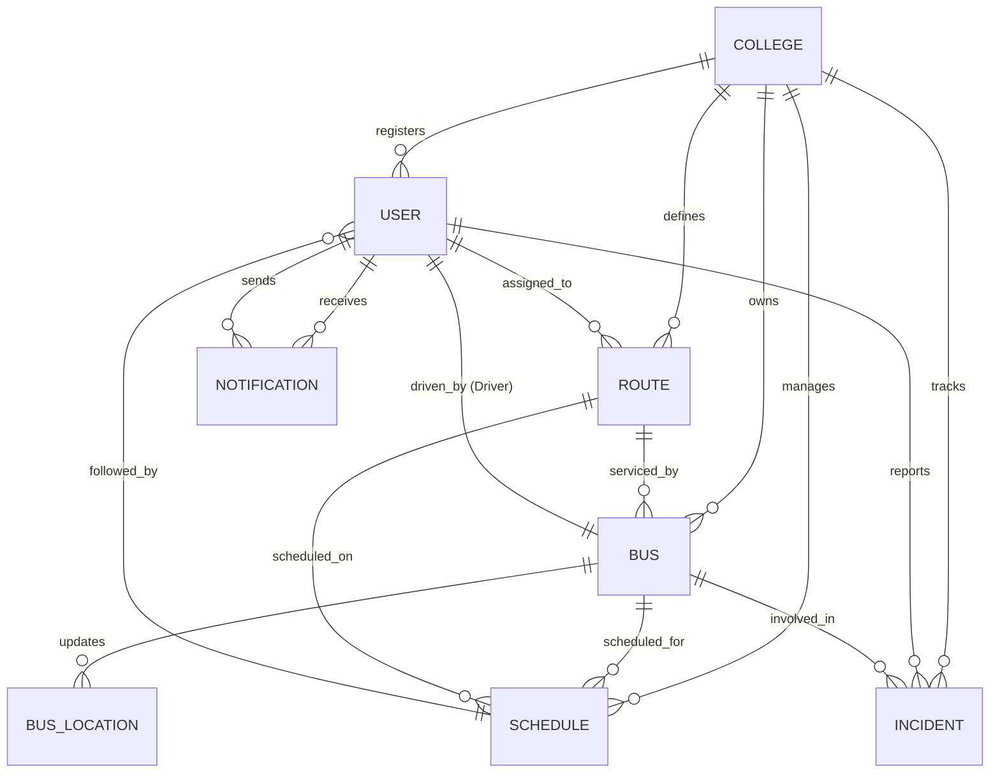

# ER Diagram - College Bus Tracking System

This diagram illustrates the relationships between key entities in the system.

```mermaid
erDiagram
    COLLEGE ||--o{ USER : "registers"
    COLLEGE ||--o{ BUS : "owns"
    COLLEGE ||--o{ ROUTE : "defines"
    COLLEGE ||--o{ SCHEDULE : "manages"
    COLLEGE ||--o{ INCIDENT : "tracks"

    USER ||--o{ NOTIFICATION : "receives"
    USER ||--o{ NOTIFICATION : "sends"
    USER ||--o{ INCIDENT : "reports"
    USER ||--o{ ROUTE : "assigned_to"

    BUS ||--o{ BUS_LOCATION : "updates"
    BUS ||--o{ SCHEDULE : "scheduled_for"
    BUS ||--o{ INCIDENT : "involved_in"
    BUS ||--|| USER : "driven_by (Driver)"

    ROUTE ||--o{ BUS : "serviced_by"
    ROUTE ||--o{ SCHEDULE : "scheduled_on"

    SCHEDULE ||--o{ USER : "followed_by"
```

---
