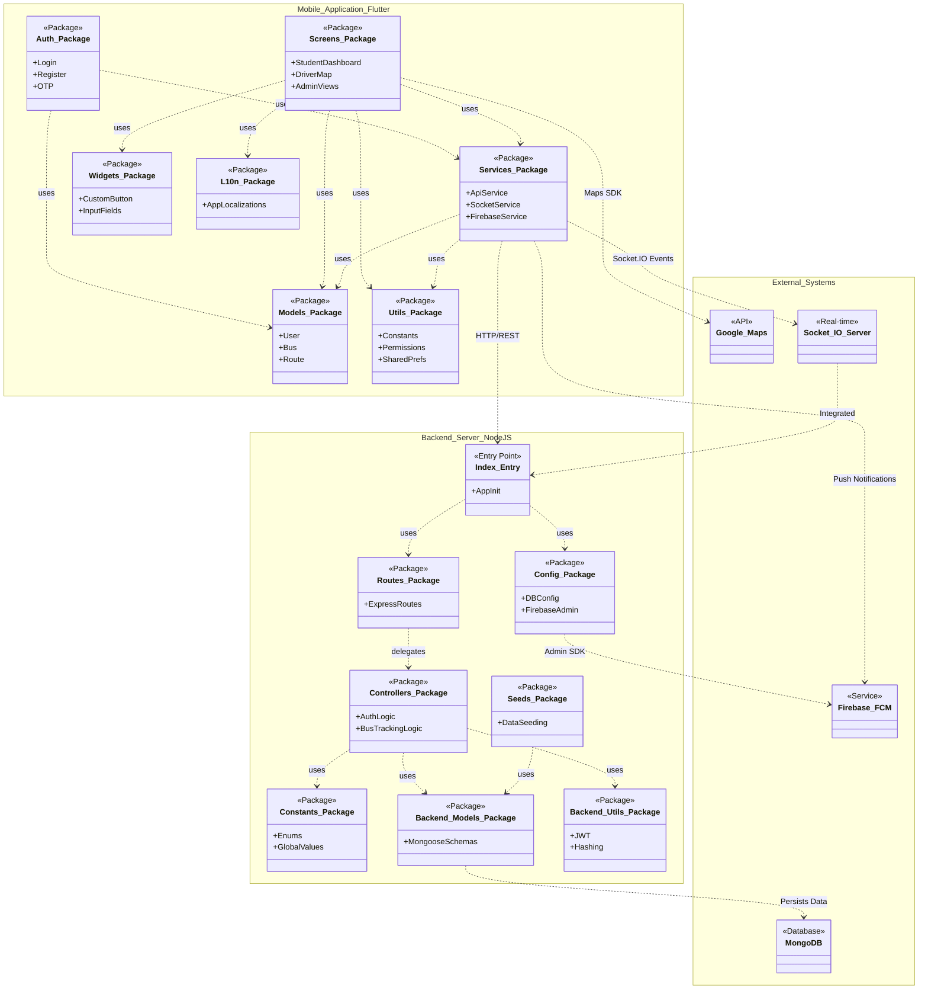

# UML Package Diagram - College Bus Tracking System

This diagram represents the high-level package organization and dependencies for the Flutter Frontend and Node.js Backend.

```mermaid
classDiagram
    namespace Mobile_Application_Flutter {
        class Auth_Package {
            <<Package>>
            +Login
            +Register
            +OTP
        }
        class Models_Package {
            <<Package>>
            +User
            +Bus
            +Route
        }
        class Screens_Package {
            <<Package>>
            +StudentDashboard
            +DriverMap
            +AdminViews
        }
        class Services_Package {
            <<Package>>
            +ApiService
            +SocketService
            +FirebaseService
        }
        class Widgets_Package {
            <<Package>>
            +CustomButton
            +InputFields
        }
        class Utils_Package {
            <<Package>>
            +Constants
            +Permissions
            +SharedPrefs
        }
        class L10n_Package {
            <<Package>>
            +AppLocalizations
        }
    }

    namespace Backend_Server_NodeJS {
        class Config_Package {
            <<Package>>
            +DBConfig
            +FirebaseAdmin
        }
        class Constants_Package {
            <<Package>>
            +Enums
            +GlobalValues
        }
        class Backend_Models_Package {
            <<Package>>
            +MongooseSchemas
        }
        class Controllers_Package {
            <<Package>>
            +AuthLogic
            +BusTrackingLogic
        }
        class Routes_Package {
            <<Package>>
            +ExpressRoutes
        }
        class Backend_Utils_Package {
            <<Package>>
            +JWT
            +Hashing
        }
        class Seeds_Package {
            <<Package>>
            +DataSeeding
        }
        class Index_Entry {
            <<Entry Point>>
            +AppInit
        }
    }

    namespace External_Systems {
        class MongoDB {
            <<Database>>
        }
        class Firebase_FCM {
            <<Service>>
        }
        class Google_Maps {
            <<API>>
        }
        class Socket_IO_Server {
            <<Real-time>>
        }
    }

    %% Flutter Internals
    Auth_Package ..> Services_Package : uses
    Auth_Package ..> Models_Package : uses
    Screens_Package ..> Models_Package : uses
    Screens_Package ..> Services_Package : uses
    Screens_Package ..> Widgets_Package : uses
    Screens_Package ..> Utils_Package : uses
    Screens_Package ..> L10n_Package : uses
    Services_Package ..> Models_Package : uses
    Services_Package ..> Utils_Package : uses

    %% Backend Internals
    Index_Entry ..> Config_Package : uses
    Index_Entry ..> Routes_Package : uses
    Routes_Package ..> Controllers_Package : delegates
    Controllers_Package ..> Backend_Models_Package : uses
    Controllers_Package ..> Backend_Utils_Package : uses
    Controllers_Package ..> Constants_Package : uses
    Seeds_Package ..> Backend_Models_Package : uses

    %% Cross-System Communication
    Services_Package ..> Index_Entry : HTTP/REST
    Services_Package ..> Socket_IO_Server : Socket.IO Events
    Socket_IO_Server ..> Index_Entry : Integrated

    %% External Dependencies
    Backend_Models_Package ..> MongoDB : Persists Data
    Services_Package ..> Firebase_FCM : Push Notifications
    Config_Package ..> Firebase_FCM : Admin SDK
    Screens_Package ..> Google_Maps : Maps SDK
```
