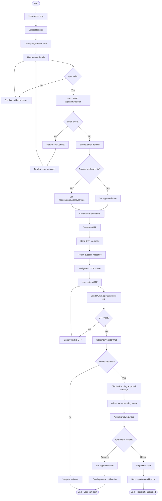

# AD1: User Registration and Approval Process

**Activity Diagram ID:** AD1  
**Process Name:** User Registration and Approval  
**Version:** 1.0  
**Date:** 2025-12-29

---

## 1. Purpose

This activity diagram models the complete user onboarding workflow from initial registration through account activation. It covers different paths based on email domain validation, manual approval requirements, and OTP verification.

---

## 2. Actors / Roles

| Role                                 | Participation                                    |
| ------------------------------------ | ------------------------------------------------ |
| User (Student/Teacher/Driver/Parent) | Initiates registration                           |
| Mobile Application                   | Validates input, communicates with backend       |
| Backend Server                       | Processes registration, evaluates approval rules |
| Admin                                | Reviews and approves/rejects pending accounts    |

---

## 3. Mermaid Diagram

---

## 4. Notes / Conditions

### Preconditions

- Mobile application is installed
- Backend server is operational

### Postconditions

- User account exists in database with appropriate approval status

### Exceptional Flows

- **Network Failure:** App displays retry option
- **OTP Expiry:** User can request new OTP

---

## 5. Modules / Components Represented

| Component          | Activities                                 |
| ------------------ | ------------------------------------------ |
| Flutter Mobile App | Form display, input validation, navigation |
| Node.js Backend    | Registration processing, OTP generation    |
| MongoDB            | User document storage                      |
| Email Service      | OTP delivery                               |
| FCM                | Approval notifications                     |
