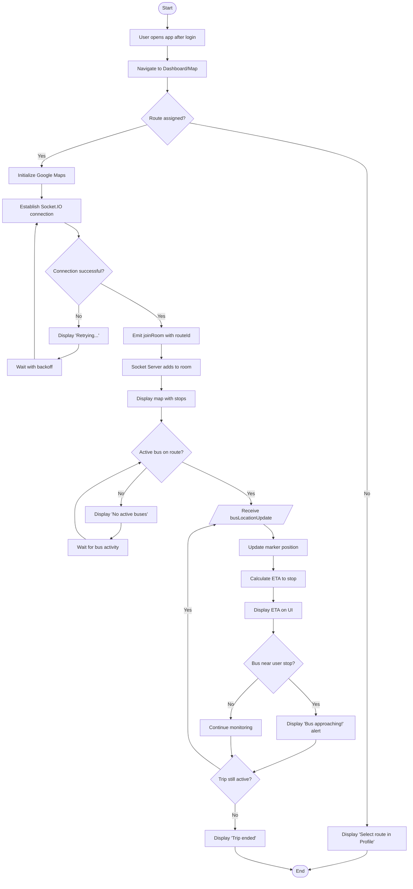

# AD2: Real-Time Bus Tracking Process

**Activity Diagram ID:** AD2  
**Process Name:** Real-Time Bus Tracking  
**Version:** 1.0  
**Date:** 2025-12-29

---

## 1. Purpose

This activity diagram models the real-time bus tracking workflow from the perspective of Students, Teachers, and Parents. It describes how users subscribe to location updates, receive real-time data via WebSocket, and visualize bus positions on an interactive map.

---

## 2. Actors / Roles

| Role                       | Participation                      |
| -------------------------- | ---------------------------------- |
| Student / Teacher / Parent | Views bus location on map          |
| Mobile Application         | Renders map, handles socket events |
| Socket.IO Server           | Manages rooms, broadcasts updates  |
| Driver                     | Provides location data             |

---

## 3. Mermaid Diagram

---

## 4. Notes / Conditions

### Preconditions

- User is authenticated
- User has an assigned route
- At least one bus is active on the route

### Real-Time Interactions

- Location updates every 5 seconds
- Socket.IO for low-latency delivery
- Animated marker movement

### Exceptional Flows

- **Driver Disconnects:** UI shows warning
- **Network Loss:** Reconnection with backoff

---

## 5. Modules / Components Represented

| Component          | Activities                        |
| ------------------ | --------------------------------- |
| Flutter Mobile App | Map rendering, ETA calculation    |
| Socket.IO Client   | Room subscription, event handling |
| Socket.IO Server   | Broadcasting location updates     |
| Google Maps SDK    | Map visualization                 |
