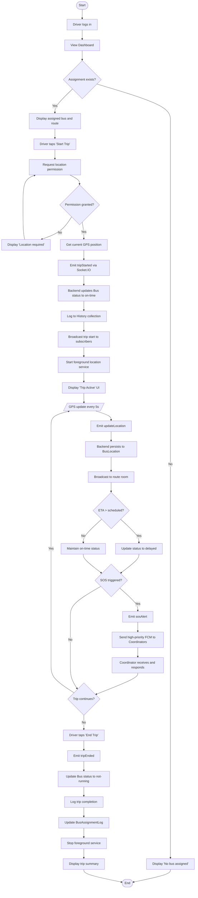

# AD3: Driver Trip Management Process

**Activity Diagram ID:** AD3  
**Process Name:** Driver Trip Management  
**Version:** 1.0  
**Date:** 2025-12-29

---

## 1. Purpose

This activity diagram models the complete trip workflow from the Driver's perspective, from starting a trip to ending it. It covers location broadcasting, delay handling, and SOS scenarios.

---

## 2. Actors / Roles

| Role              | Participation                              |
| ----------------- | ------------------------------------------ |
| Driver            | Operates bus, controls trip lifecycle      |
| Driver Mobile App | Tracks location, communicates with backend |
| Socket.IO Server  | Receives and broadcasts location           |
| Coordinator       | Receives alerts and monitors trips         |

---

## 3. Mermaid Diagram

---

## 4. Notes / Conditions

### Preconditions

- Driver is authenticated with accepted assignment
- Device has GPS capability

### Postconditions

- Trip data logged in database
- All subscribers received real-time updates

### Exceptional Flows

- **GPS Lost:** Cached last position used temporarily
- **Network Down:** Location synced on reconnect
- **App Crash:** Foreground service continues

---

## 5. Modules / Components Represented

| Component               | Activities                         |
| ----------------------- | ---------------------------------- |
| Flutter Driver App      | Trip control UI, location tracking |
| Device Location Service | GPS coordinates                    |
| Socket.IO               | Real-time communication            |
| MongoDB                 | Trip logging                       |
| FCM                     | SOS notifications                  |
