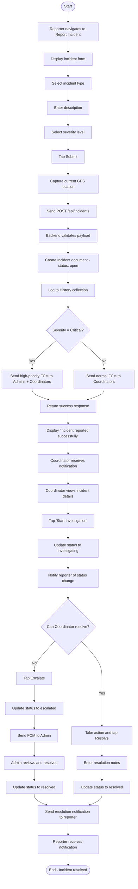

# AD4: Incident Reporting and Resolution Process

**Activity Diagram ID:** AD4  
**Process Name:** Incident Reporting and Resolution  
**Version:** 1.0  
**Date:** 2025-12-29

---

## 1. Purpose

This activity diagram models the workflow for reporting and resolving incidents within the bus tracking system. It covers submission, Coordinator review, escalation, and resolution.

---

## 2. Actors / Roles

| Role             | Participation                  |
| ---------------- | ------------------------------ |
| Driver / Student | Reports the incident           |
| Backend Server   | Processes and stores incident  |
| Coordinator      | Reviews and resolves incidents |
| Admin            | Handles escalated incidents    |

---

## 3. Mermaid Diagram

---

## 4. Notes / Conditions

### Preconditions

- Reporter is authenticated
- Incident has occurred

### Postconditions

- Incident logged and resolved
- All parties notified

### Exceptional Flows

- **Reopen:** Resolved incident can be reopened
- **Auto-Escalation:** Critical incidents auto-escalate after timeout

---

## 5. Modules / Components Represented

| Component          | Activities                    |
| ------------------ | ----------------------------- |
| Flutter Mobile App | Incident form, status display |
| Node.js Backend    | Incident CRUD, status updates |
| MongoDB            | Incident and History storage  |
| FCM                | Alert notifications           |
