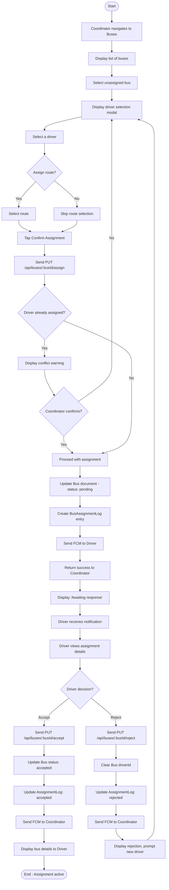

# AD5: Bus-Driver Assignment Process

**Activity Diagram ID:** AD5  
**Process Name:** Bus-Driver Assignment  
**Version:** 1.0  
**Date:** 2025-12-29

---

## 1. Purpose

This activity diagram models the workflow for a Coordinator to assign a Driver to a Bus, and the subsequent Driver response (accept/reject).

---

## 2. Actors / Roles

| Role                 | Participation          |
| -------------------- | ---------------------- |
| Coordinator          | Creates the assignment |
| Backend Server       | Processes assignment   |
| Driver               | Responds to assignment |
| Notification Service | Sends alerts           |

---

## 3. Mermaid Diagram

---

## 4. Notes / Conditions

### Preconditions

- Coordinator has appropriate role
- Bus and Driver exist in system

### Postconditions

- Assignment logged with outcome
- Both parties notified

### Exceptional Flows

- **Timeout:** Auto-reject after configured period
- **Cancel:** Coordinator can cancel pending assignment

---

## 5. Modules / Components Represented

| Component               | Activities                    |
| ----------------------- | ----------------------------- |
| Flutter Coordinator App | Assignment UI                 |
| Flutter Driver App      | Response UI                   |
| Node.js Backend         | Assignment logic              |
| MongoDB                 | Bus and AssignmentLog storage |
| FCM                     | Notifications                 |
