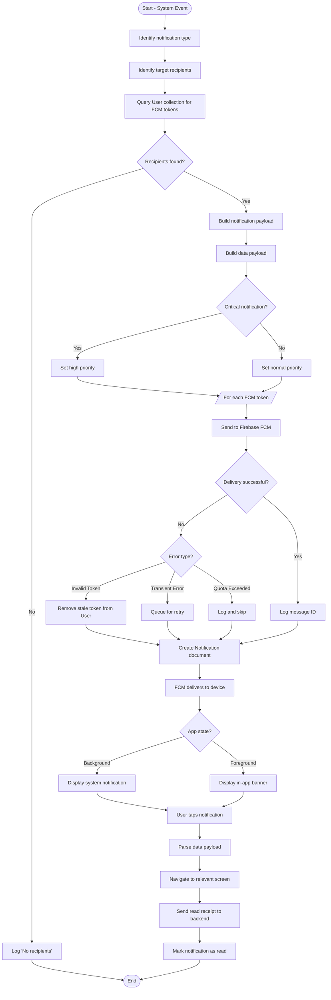

# AD6: Push Notification Delivery Workflow

**Activity Diagram ID:** AD6  
**Process Name:** Push Notification Delivery  
**Version:** 1.0  
**Date:** 2025-12-29

---

## 1. Purpose

This activity diagram models the end-to-end workflow for generating, sending, and receiving push notifications within the system.

---

## 2. Actors / Roles

| Role               | Participation                     |
| ------------------ | --------------------------------- |
| System Event       | Initiates notification            |
| Backend Server     | Constructs and sends notification |
| Firebase FCM       | Delivers to devices               |
| Mobile Application | Receives and displays             |
| User (All Roles)   | Views notification                |

---

## 3. Mermaid Diagram

---

## 4. Notes / Conditions

### Notification Types

| Type                | Trigger            | Priority |
| ------------------- | ------------------ | -------- |
| `bus_arriving`      | Bus proximity      | High     |
| `assignment_update` | New assignment     | High     |
| `incident`          | Incident reported  | High     |
| `trip_status`       | Trip started/ended | Normal   |

### Retry Logic

- Max 3 retries with exponential backoff
- Failed after retries: log and alert admin

---

## 5. Modules / Components Represented

| Component          | Activities                              |
| ------------------ | --------------------------------------- |
| Node.js Backend    | Payload construction, FCM communication |
| Firebase Admin SDK | Message sending                         |
| Firebase FCM       | Delivery                                |
| Flutter Mobile App | Display and interaction                 |
| MongoDB            | Notification logging                    |
