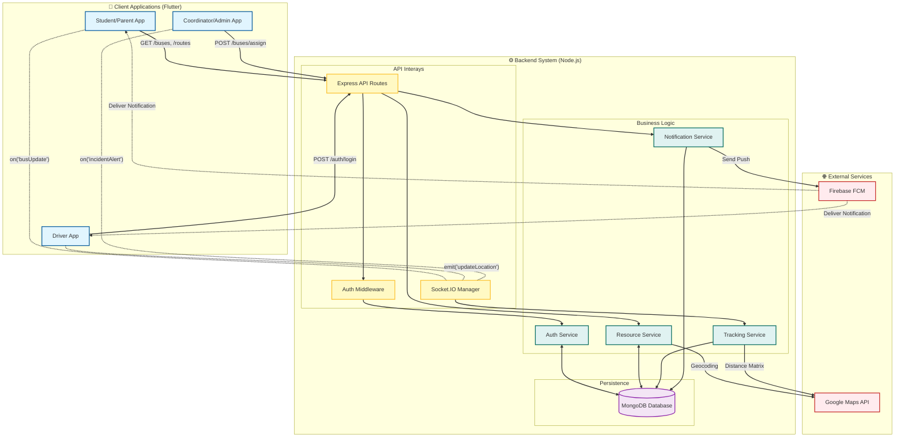

# API Architecture Diagram – College Bus Tracking System

**Diagram ID:** API_ARCH_01  
**System:** College Bus Tracking System  
**Version:** 1.0  
**Date:** 2025-12-30

---

## 1. Purpose

This diagram illustrates the high-level API architecture of the College Bus Tracking System. It details the interaction between client applications, the backend API layer, internal services, data stores, and external third-party integrations. It differentiates between standard RESTful HTTP communication and real-time WebSocket events.

---

## 2. Architectural Components

### Clients (Flutter Mobile App)

- **Student / Parent App**: Consumes read-only location data and notifications.
- **Driver App**: Produces high-frequency GPS location streams.
- **Coordinator / Admin App**: Manages resources via CRUD operations.

### API Layer (Node.js/Express)

- **API Gateway / Routes**: Entry point for all HTTP requests.
- **Middleware**: Handles JWT authentication, request validation, and rate limiting.
- **Socket.IO Handler**: Manages real-time event rooms and namespaces.

### Service Layer

- **Auth Service**: User registration and session management.
- **Tracking Service**: Processes live location updates and spatial queries.
- **Resource Service**: Manages bus, route, and stop data.
- **Notification Service**: Triggers and manages push notifications.

### Data Layer

- **MongoDB**: Primary persistent storage for all application data.

### External Services

- **Google Maps Platform**: Used for geocoding and map visualization.
- **Firebase Cloud Messaging (FCM)**: Used for delivering push notifications to devices.

---

## 3. Communication Patterns

- **HTTP/REST (Solid Lines)**: Used for transactional operations (Login, Create Incident, Get Profile).
- **WebSocket (Dotted Lines)**: Used for real-time bidirectional events (Location Update, Join Room).
- **External API (Dashed Lines)**: Integration with third-party providers.

---

## 4. Mermaid Diagram

---

## 5. Architectural Considerations

1.  **Statelessness**: The REST API is stateless; authentication is handled via JWT tokens passed in headers.
2.  **Real-Time Scalability**: Socket.IO connections are stateful. To scale horizontally, a Redis adapter would be required to synchronize events across server instances.
3.  **Security**:
    - All API endpoints are protected by `AuthMiddleware` ensuring valid JWTs.
    - Rate limiting is applied at the `Gateway` level to prevent abuse.
4.  **Data Consistency**: Location data is broadcast immediately for performance but persisted asynchronously to MongoDB for history logs.
