# Authentication & Authorization Flow Diagram

**Diagram ID:** AUTH_FLOW_01  
**System:** College Bus Tracking System  
**Version:** 1.0  
**Date:** 2025-12-30

---

## 1. Purpose

This diagram illustrates the security protocols implemented within the College Bus Tracking System. It details the sequence of operations for identifying users (Authentication) and verifying their permissions (Authorization) before granting access to protected resources and real-time streams.

---

## 2. Actors / Clients

| Actor            | Role Group                       | Description                                |
| ---------------- | -------------------------------- | ------------------------------------------ |
| **Client App**   | Student, Teacher, Parent, Driver | Mobile application initiating requests.    |
| **Admin Client** | Admin, Coordinator               | Web/Mobile interface for management tasks. |

---

## 3. Security Boundaries

- **Public Zone**: Unauthenticated endpoints (Login, Registration, Password Reset).
- **Protected Zone**: Endpoints requiring a valid JWT (User Profiles, Bus Locations).
- **Restricted Zone**: Endpoints requiring specific roles (Admin/Coordinator Only).

---

## 4. Authentication Flow

1.  **Credential Submission**: Client sends encrypted credentials (hashed/SSL) to `/api/auth/login`.
2.  **Validation**: Server verifies credentials against the **MongoDB** `User` collection.
3.  **Token Issuance**: specific payload is signed to generate a **JWT (JSON Web Token)**.
4.  **Response**: JWT is returned to the client and stored securely (e.g., `flutter_secure_storage`).

---

## 5. Authorization Flow

1.  **Request & Token**: Client includes the JWT in the `Authorization: Bearer <token>` header of subsequent requests.
2.  **Middleware Interception**: The `AuthMiddleware` intercepts the request before it reaches the controller.
3.  **Verification**: The middleware validates the token signature and expiration.
4.  **Role Check (RBAC)**: For restricted routes, the middleware checks if the user's role (encoded in the token) matches the required permissions.
5.  **Access Grant/Deny**:
    - _Success_: Request proceeds to the Service/Controller.
    - _Failure_: 401 Unauthorized or 403 Forbidden is returned.

---

## 6. Mermaid Diagram

```mermaid
sequenceDiagram
    autonumber
    participant Client as 📱 Mobile Client
    participant Gateway as 🛡️ API Gateway / Middleware
    participant AuthCtrl as 🔐 Auth Controller
    participant UserDB as 🗄️ MongoDB (Users)
    participant ProtectedRPC as 📦 Protected Service
    participant SocketGW as 🔌 Socket.IO Gateway

    note over Client, SocketGW: 🔒 PHASE 1: Authentication (Login)

    Client->>Gateway: POST /api/auth/login (email, password)
    Gateway->>AuthCtrl: Route Request
    AuthCtrl->>UserDB: Find User & Verify Password

    alt Invalid Credentials
        UserDB-->>AuthCtrl: Null / Mismatch
        AuthCtrl-->>Client: 401 Unauthorized
    else Valid Credentials
        UserDB-->>AuthCtrl: User Document
        AuthCtrl->>AuthCtrl: Generate JWT (Sign Payload)
        AuthCtrl-->>Client: 200 OK { token, userProfile }
    end

    note over Client, SocketGW: 🔐 PHASE 2: Authorization (HTTP Request)

    Client->>Gateway: GET /api/buses (Header: Bearer JWT)
    Gateway->>Gateway: AuthMiddleware: Verify Signature & Expiry

    alt Invalid/Expired Token
        Gateway-->>Client: 401 Unauthorized
    else Valid Token
        Gateway->>Gateway: RBAC: Check Role Permissions

        alt Role Denied
            Gateway-->>Client: 403 Forbidden
        else Role Allowed
            Gateway->>ProtectedRPC: Forward Request
            ProtectedRPC-->>Client: 200 OK (Data)
        end
    end

    note over Client, SocketGW: ⚡ PHASE 3: Socket Authorization (Real-Time)

    Client->>SocketGW: WebSocket Handshake (auth: { token })
    SocketGW->>SocketGW: Verify Token & Extract User

    alt Token Valid
        SocketGW-->>Client: Connection Established
        Client->>SocketGW: emit('joinRoute', routeId)
        SocketGW->>SocketGW: Join Room
    else Token Invalid
        SocketGW-->>Client: Connection Error (Authentication Error)
        SocketGW->>SocketGW: Disconnect
    end
```

---

## 7. Security Considerations

- **Transport Security**: All traffic MUST be encrypted via HTTPS (TLS 1.2+).
- **Token Storage**: On mobile devices, tokens should be stored in the OS-backed Keystore/Keychain, not in shared preferences or plain text.
- **Short-lived Tokens**: Access tokens should have a short expiration (e.g., 1 hour).
- **Privilege Separation**: Admin and Coordinator roles effectively have superuser access to specific modules; their endpoints require stricter validation.
