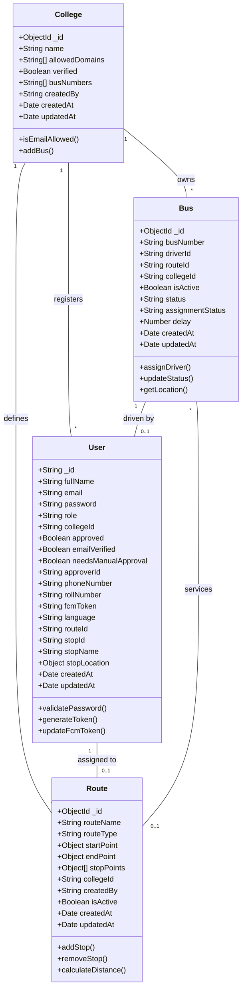

# CD1: Core Data Models

**Class Diagram ID:** CD1  
**Module Name:** Core Data Models  
**Version:** 1.0  
**Date:** 2025-12-29

---

## 1. Purpose

This class diagram models the core entities of the College Bus Tracking System: User, College, Bus, and Route. These are the foundational data structures upon which all system functionality is built.

---

## 2. Classes

| Class   | Description                                                                        |
| ------- | ---------------------------------------------------------------------------------- |
| User    | Represents all system users (Student, Teacher, Driver, Admin, Coordinator, Parent) |
| College | Represents an educational institution using the system                             |
| Bus     | Represents a bus vehicle in the fleet                                              |
| Route   | Represents a defined path with stops                                               |

---

## 3. Mermaid Diagram

---

## 4. Relationships

| Relationship        | Type        | Description                         |
| ------------------- | ----------- | ----------------------------------- |
| College → User      | One-to-Many | A college has many registered users |
| College → Bus       | One-to-Many | A college owns many buses           |
| College → Route     | One-to-Many | A college defines many routes       |
| User → Route        | Many-to-One | Users are assigned to a route       |
| Bus → Route         | Many-to-One | Buses service a route               |
| Bus → User (Driver) | One-to-One  | A bus has one assigned driver       |

---

## 5. Actors / Roles

| Class   | Interacting Roles                                                   |
| ------- | ------------------------------------------------------------------- |
| User    | All roles (role-based polymorphism via `role` attribute)            |
| College | Admin (manages), All users (belongs to)                             |
| Bus     | Driver (operates), Coordinator (assigns), Students/Teachers (track) |
| Route   | Coordinator (creates), All users (assigned/view)                    |

---

## 6. Modules / Components Represented

| Component | Implementation                    |
| --------- | --------------------------------- |
| MongoDB   | Mongoose schemas in `src/models/` |
| Flutter   | Data classes in `lib/models/`     |
| Backend   | CRUD operations via Controllers   |

---

## 7. Notes / Considerations

- **Role-Based Design:** User class uses a `role` enum rather than inheritance for simplicity.
- **Geospatial:** `stopLocation` and route points use `{lat, lng}` for map integration.
- **Soft Delete:** `isActive` flag enables soft deletion of buses and routes.
