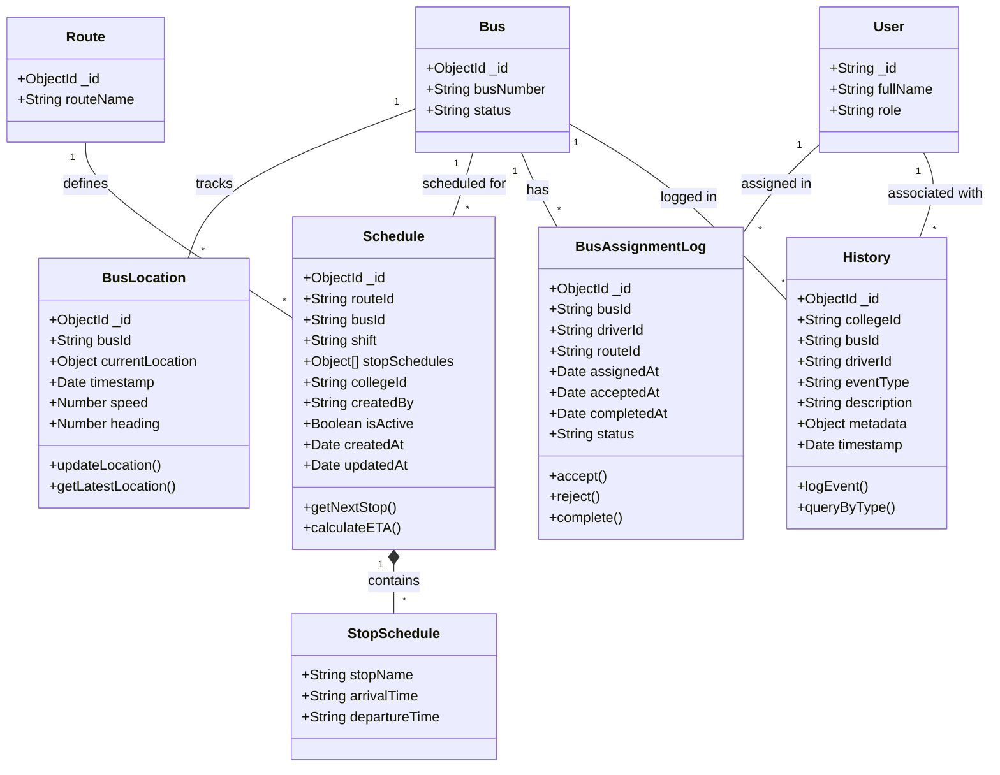

# CD2: Trip and Location Models

**Class Diagram ID:** CD2  
**Module Name:** Trip and Location Models  
**Version:** 1.0  
**Date:** 2025-12-29

---

## 1. Purpose

This class diagram models the entities related to bus trips, real-time location tracking, scheduling, and assignment logging. These classes are critical for the core functionality of live bus tracking.

---

## 2. Classes

| Class            | Description                              |
| ---------------- | ---------------------------------------- |
| BusLocation      | Real-time location data for a bus        |
| Schedule         | Time-based schedule for routes and stops |
| BusAssignmentLog | Historical log of driver-bus assignments |
| History          | General event log for audit trail        |

---

## 3. Mermaid Diagram

---

## 4. Relationships

| Relationship            | Type        | Description                     |
| ----------------------- | ----------- | ------------------------------- |
| Bus → BusLocation       | One-to-Many | A bus has many location records |
| Bus → Schedule          | One-to-Many | A bus has multiple schedules    |
| Route → Schedule        | One-to-Many | A route has schedules           |
| Schedule → StopSchedule | Composition | Schedule contains stop times    |
| Bus → BusAssignmentLog  | One-to-Many | Assignment history for a bus    |
| Bus/User → History      | One-to-Many | Event logs reference entities   |

---

## 5. Actors / Roles

| Class            | Interacting Roles                          |
| ---------------- | ------------------------------------------ |
| BusLocation      | Driver (updates), Students/Teachers (view) |
| Schedule         | Coordinator (creates), All users (view)    |
| BusAssignmentLog | Coordinator (creates), Driver (responds)   |
| History          | Admin/Coordinator (view), System (writes)  |

---

## 6. Modules / Components Represented

| Component | Implementation                                                       |
| --------- | -------------------------------------------------------------------- |
| MongoDB   | `BusLocation`, `Schedule`, `History`, `BusAssignmentLog` collections |
| Socket.IO | Real-time `BusLocation` updates                                      |
| Backend   | Trip lifecycle management                                            |

---

## 7. Notes / Considerations

- **Real-Time Updates:** `BusLocation` is updated every 5 seconds during active trips.
- **Indexing:** `BusLocation` and `History` are indexed by timestamp for efficient queries.
- **Audit Trail:** `History` provides a complete event log for compliance and debugging.
