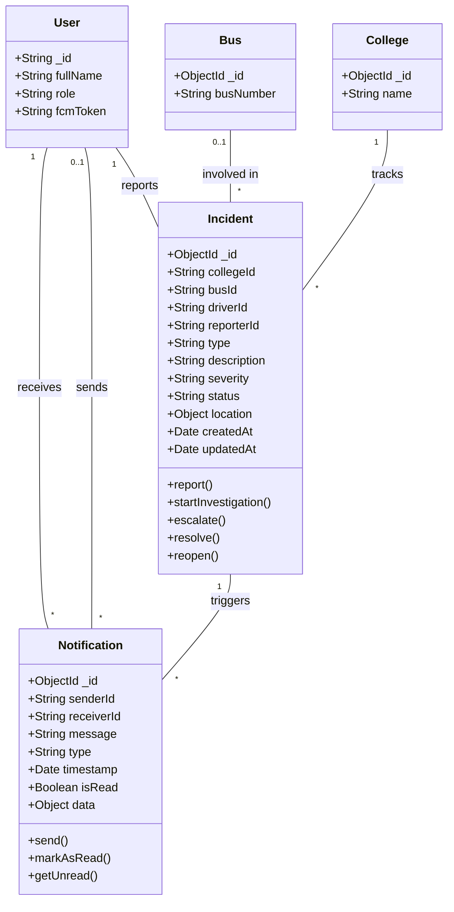

# CD3: Incident and Notification Models

**Class Diagram ID:** CD3  
**Module Name:** Incident and Notification Models  
**Version:** 1.0  
**Date:** 2025-12-29

---

## 1. Purpose

This class diagram models the Incident and Notification entities, which handle exception management and communication within the system.

---

## 2. Classes

| Class        | Description                                                 |
| ------------ | ----------------------------------------------------------- |
| Incident     | Represents a reported incident (accident, breakdown, delay) |
| Notification | Represents a push notification sent to users                |

---

## 3. Mermaid Diagram

---

## 4. Relationships

| Relationship            | Type                   | Description                          |
| ----------------------- | ---------------------- | ------------------------------------ |
| User → Incident         | One-to-Many            | A user can report multiple incidents |
| User → Notification     | One-to-Many            | A user receives many notifications   |
| Bus → Incident          | One-to-Many (optional) | An incident may involve a bus        |
| Incident → Notification | One-to-Many            | An incident triggers notifications   |

---

## 5. Actors / Roles

| Class        | Interacting Roles                                      |
| ------------ | ------------------------------------------------------ |
| Incident     | Driver/Student (reports), Coordinator/Admin (resolves) |
| Notification | All roles (receive), System (sends)                    |

---

## 6. Modules / Components Represented

| Component | Implementation                         |
| --------- | -------------------------------------- |
| MongoDB   | `Incident`, `Notification` collections |
| FCM       | Notification delivery                  |
| Backend   | Incident CRUD, notification triggers   |

---

## 7. Notes / Considerations

- **Incident Lifecycle:** `status` transitions: open → investigating → resolved/escalated.
- **Notification Types:** `bus_arriving`, `assignment_update`, `incident`, `approval_result`.
- **FCM Integration:** `Notification.send()` uses Firebase Admin SDK.
