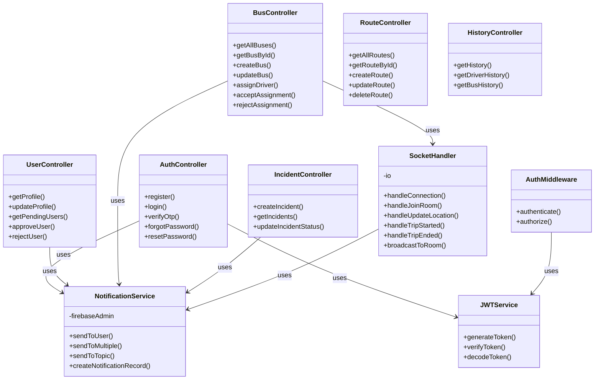

# CD4: Backend Services Architecture

**Class Diagram ID:** CD4  
**Module Name:** Backend Services Architecture  
**Version:** 1.0  
**Date:** 2025-12-29

---

## 1. Purpose

This class diagram models the service layer architecture of the Node.js backend, showing controllers, services, and their dependencies.

---

## 2. Classes

| Class               | Description                            |
| ------------------- | -------------------------------------- |
| AuthController      | Handles authentication endpoints       |
| UserController      | Manages user CRUD operations           |
| BusController       | Manages bus operations and assignments |
| RouteController     | Manages route CRUD operations          |
| IncidentController  | Handles incident reporting             |
| HistoryController   | Queries event logs                     |
| NotificationService | Sends push notifications               |
| SocketHandler       | Manages WebSocket events               |

---

## 3. Mermaid Diagram

---

## 4. Relationships

| Relationship                        | Type       | Description                                 |
| ----------------------------------- | ---------- | ------------------------------------------- |
| Controllers → Services              | Dependency | Controllers use services for business logic |
| Controllers → NotificationService   | Dependency | Trigger notifications on events             |
| SocketHandler → NotificationService | Dependency | Send alerts on real-time events             |
| AuthMiddleware → JWTService         | Dependency | Validate tokens                             |

---

## 5. Actors / Roles

| Class          | Interacting Roles                              |
| -------------- | ---------------------------------------------- |
| AuthController | All roles (login/register)                     |
| UserController | Admin (approve), All roles (profile)           |
| BusController  | Coordinator (assign), Driver (accept/reject)   |
| SocketHandler  | Driver (location), Students/Teachers (receive) |

---

## 6. Modules / Components Represented

| Component      | Location           |
| -------------- | ------------------ |
| Controllers    | `src/controllers/` |
| Services       | `src/services/`    |
| Socket Handler | `src/socket.ts`    |
| Middleware     | `src/middleware/`  |

---

## 7. Notes / Considerations

- **Stateless Design:** Controllers are stateless; state is managed in database.
- **Dependency Injection:** Services are imported and used by controllers.
- **Real-Time:** SocketHandler manages all WebSocket communication.
