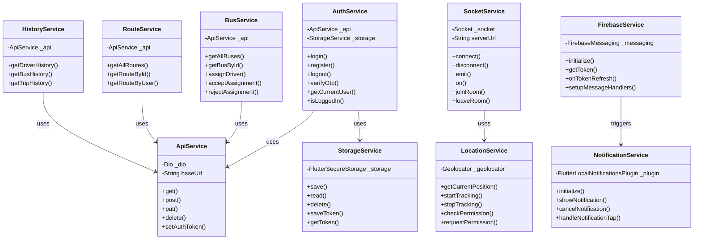

# CD5: Frontend Services Architecture

**Class Diagram ID:** CD5  
**Module Name:** Frontend Services Architecture  
**Version:** 1.0  
**Date:** 2025-12-29

---

## 1. Purpose

This class diagram models the service layer architecture of the Flutter mobile application, showing services, providers, and their interactions with the backend.

---

## 2. Classes

| Class               | Description                          |
| ------------------- | ------------------------------------ |
| AuthService         | Handles authentication API calls     |
| ApiService          | Base HTTP client using Dio           |
| SocketService       | Manages Socket.IO connection         |
| LocationService     | Handles device GPS                   |
| FirebaseService     | Manages FCM tokens and notifications |
| NotificationService | Handles local notification display   |
| StorageService      | Manages secure local storage         |

---

## 3. Mermaid Diagram

---

## 4. Relationships

| Relationship                          | Type       | Description                           |
| ------------------------------------- | ---------- | ------------------------------------- |
| Services → ApiService                 | Dependency | All API services use base HTTP client |
| AuthService → StorageService          | Dependency | Stores tokens securely                |
| FirebaseService → NotificationService | Dependency | FCM triggers local notifications      |
| SocketService → LocationService       | Dependency | Location data for real-time updates   |

---

## 5. Actors / Roles

| Class           | Interacting Roles                         |
| --------------- | ----------------------------------------- |
| AuthService     | All roles                                 |
| SocketService   | Driver (emit), Students/Teachers (listen) |
| LocationService | Driver (GPS tracking)                     |
| FirebaseService | All roles (receive notifications)         |
| BusService      | Coordinator, Driver                       |

---

## 6. Modules / Components Represented

| Component | Location        |
| --------- | --------------- |
| Services  | `lib/services/` |
| Core      | `lib/core/`     |
| Utils     | `lib/utils/`    |

---

## 7. Notes / Considerations

- **Singleton Pattern:** Services are typically singletons or provided via dependency injection.
- **Secure Storage:** `StorageService` uses Flutter Secure Storage for sensitive data.
- **Background Location:** `LocationService` uses foreground service for continuous tracking.
