# COMP1: System Overview Architecture

**Component Diagram ID:** COMP1  
**Module Name:** System Overview Architecture  
**Version:** 1.0  
**Date:** 2025-12-29

---

## 1. Purpose

This component diagram provides a high-level overview of the entire College Bus Tracking System architecture, showing the major subsystems and their interactions.

---

## 2. Components

| Component            | Description                       |
| -------------------- | --------------------------------- |
| Flutter Mobile App   | Cross-platform mobile application |
| Node.js Backend      | Express-based REST API server     |
| MongoDB Atlas        | Cloud database service            |
| Socket.IO Server     | Real-time WebSocket communication |
| Firebase FCM         | Push notification service         |
| Google Maps Platform | Map and geocoding services        |

---

## 3. Mermaid Diagram

```mermaid
flowchart TB
    subgraph Client["Client Layer"]
        StudentApp["📱 Student App"]
        TeacherApp["📱 Teacher App"]
        DriverApp["📱 Driver App"]
        CoordinatorApp["📱 Coordinator App"]
        AdminApp["📱 Admin App"]
    end

    subgraph Backend["Backend Layer"]
        APIGateway["🌐 REST API Gateway\n(Express.js)"]
        SocketServer["⚡ Socket.IO Server"]
        AuthModule["🔐 Auth Module"]
        BusinessLogic["⚙️ Business Logic\n(Controllers)"]
    end

    subgraph DataLayer["Data Layer"]
        MongoDB[("🗄️ MongoDB Atlas")]
    end

    subgraph ExternalServices["External Services"]
        Firebase["🔔 Firebase FCM"]
        GoogleMaps["🗺️ Google Maps API"]
    end

    StudentApp --> APIGateway
    TeacherApp --> APIGateway
    DriverApp --> APIGateway
    CoordinatorApp --> APIGateway
    AdminApp --> APIGateway

    StudentApp <--> SocketServer
    TeacherApp <--> SocketServer
    DriverApp <--> SocketServer

    APIGateway --> AuthModule
    APIGateway --> BusinessLogic
    BusinessLogic --> MongoDB
    SocketServer --> MongoDB

    BusinessLogic --> Firebase
    SocketServer --> Firebase

    StudentApp --> GoogleMaps
    TeacherApp --> GoogleMaps
    DriverApp --> GoogleMaps
```

---

## 4. Interfaces / Dependencies

| Interface          | Provider         | Consumer    | Protocol       |
| ------------------ | ---------------- | ----------- | -------------- |
| REST API           | Backend          | Mobile Apps | HTTPS          |
| WebSocket          | Socket.IO Server | Mobile Apps | WSS            |
| Push Notifications | Firebase FCM     | Mobile Apps | FCM SDK        |
| Maps SDK           | Google Maps      | Mobile Apps | HTTPS          |
| Database           | MongoDB Atlas    | Backend     | MongoDB Driver |

---

## 5. Actors / Roles

| Component       | Interacting Roles     |
| --------------- | --------------------- |
| Student App     | Students, Parents     |
| Teacher App     | Teachers              |
| Driver App      | Drivers               |
| Coordinator App | Bus Coordinators      |
| Admin App       | System Administrators |

---

## 6. Notes / Considerations

- **Scalability:** Backend is stateless; horizontal scaling is possible.
- **Security:** All communication uses HTTPS/WSS with JWT authentication.
- **Real-Time:** Socket.IO enables bidirectional real-time updates.
