# COMP2: Mobile Application Components

**Component Diagram ID:** COMP2  
**Module Name:** Mobile Application Components  
**Version:** 1.0  
**Date:** 2025-12-29

---

## 1. Purpose

This component diagram details the internal architecture of the Flutter mobile application, showing the modular structure and inter-component dependencies.

---

## 2. Components

| Component | Description                          |
| --------- | ------------------------------------ |
| Screens   | UI layer organized by user roles     |
| Services  | Business logic and API communication |
| Providers | State management (Provider/Riverpod) |
| Models    | Data transfer objects                |
| Widgets   | Reusable UI components               |
| Utils     | Helper functions and constants       |

---

## 3. Mermaid Diagram

```mermaid
flowchart TB
    subgraph Presentation["Presentation Layer"]
        Screens["📱 Screens"]
        Widgets["🧩 Widgets"]
        subgraph RoleScreens["Role-Based Screens"]
            StudentScreens["Student Screens"]
            DriverScreens["Driver Screens"]
            CoordScreens["Coordinator Screens"]
            AdminScreens["Admin Screens"]
        end
    end

    subgraph StateManagement["State Management"]
        Providers["📦 Providers"]
        AuthProvider["Auth Provider"]
        BusProvider["Bus Provider"]
        LocationProvider["Location Provider"]
    end

    subgraph ServiceLayer["Service Layer"]
        ApiService["🌐 API Service"]
        SocketService["⚡ Socket Service"]
        LocationService["📍 Location Service"]
        FirebaseService["🔔 Firebase Service"]
        StorageService["💾 Storage Service"]
    end

    subgraph DataLayer["Data Layer"]
        Models["📋 Models"]
        UserModel["User Model"]
        BusModel["Bus Model"]
        RouteModel["Route Model"]
    end

    subgraph Core["Core / Utils"]
        Utils["🔧 Utils"]
        Constants["Constants"]
        Helpers["Helpers"]
        L10n["Localization"]
    end

    Screens --> Providers
    Screens --> Widgets
    Screens --> Utils

    RoleScreens --> Providers

    Providers --> ServiceLayer

    ApiService --> Models
    SocketService --> Models

    ServiceLayer --> StorageService
```

---

## 4. Interfaces / Dependencies

| Interface        | Provider                  | Consumer               |
| ---------------- | ------------------------- | ---------------------- |
| AuthProvider     | AuthService               | Login/Register Screens |
| BusProvider      | ApiService, SocketService | Dashboard Screens      |
| LocationProvider | LocationService           | Driver Screens         |
| Navigation       | Router                    | All Screens            |

---

## 5. Actors / Roles

| Component           | Interacting Roles |
| ------------------- | ----------------- |
| Student Screens     | Students, Parents |
| Driver Screens      | Drivers           |
| Coordinator Screens | Bus Coordinators  |
| Admin Screens       | Administrators    |

---

## 6. Notes / Considerations

- **Clean Architecture:** Separation of concerns between UI, Business Logic, and Data.
- **Dependency Injection:** Services are injected via Provider pattern.
- **Localization:** Multi-language support via `l10n` package (English, Hindi, Telugu).
