# COMP3: Backend Server Components

**Component Diagram ID:** COMP3  
**Module Name:** Backend Server Components  
**Version:** 1.0  
**Date:** 2025-12-29

---

## 1. Purpose

This component diagram details the internal architecture of the Node.js backend server, showing the layered structure and component dependencies.

---

## 2. Components

| Component      | Description                   |
| -------------- | ----------------------------- |
| Routes         | Express route definitions     |
| Controllers    | Business logic handlers       |
| Models         | Mongoose schema definitions   |
| Middleware     | Authentication and validation |
| Services       | External service integrations |
| Socket Handler | Real-time event management    |

---

## 3. Mermaid Diagram

```mermaid
flowchart TB
    subgraph EntryPoint["Entry Point"]
        Index["🚀 index.ts"]
    end

    subgraph Middleware["Middleware Layer"]
        AuthMiddleware["🔐 Auth Middleware"]
        RateLimiter["⏱️ Rate Limiter"]
        ErrorHandler["❌ Error Handler"]
    end

    subgraph Routes["Routes Layer"]
        AuthRoutes["Auth Routes"]
        UserRoutes["User Routes"]
        BusRoutes["Bus Routes"]
        RouteRoutes["Route Routes"]
        IncidentRoutes["Incident Routes"]
        HistoryRoutes["History Routes"]
    end

    subgraph Controllers["Controller Layer"]
        AuthController["Auth Controller"]
        UserController["User Controller"]
        BusController["Bus Controller"]
        RouteController["Route Controller"]
        IncidentController["Incident Controller"]
    end

    subgraph Models["Model Layer"]
        UserModel["User Model"]
        BusModel["Bus Model"]
        RouteModel["Route Model"]
        ScheduleModel["Schedule Model"]
        IncidentModel["Incident Model"]
        HistoryModel["History Model"]
    end

    subgraph Services["Service Layer"]
        NotificationService["🔔 Notification Service"]
        JWTService["🔑 JWT Service"]
    end

    subgraph RealTime["Real-Time Layer"]
        SocketHandler["⚡ Socket.IO Handler"]
    end

    subgraph External["External Connections"]
        MongoDB[("🗄️ MongoDB")]
        Firebase["🔔 Firebase FCM"]
    end

    Index --> Middleware
    Index --> Routes
    Index --> SocketHandler

    Middleware --> Routes
    Routes --> Controllers
    Controllers --> Models
    Controllers --> Services

    Models --> MongoDB
    Services --> Firebase
    SocketHandler --> Models
    SocketHandler --> Services
```

---

## 4. Interfaces / Dependencies

| Interface     | Provider       | Consumer             | Type      |
| ------------- | -------------- | -------------------- | --------- |
| /api/auth/\*  | Auth Routes    | Mobile Apps          | REST      |
| /api/users/\* | User Routes    | Mobile Apps          | REST      |
| /api/buses/\* | Bus Routes     | Mobile Apps          | REST      |
| Socket Events | Socket Handler | Mobile Apps          | WebSocket |
| FCM           | Firebase       | Notification Service | SDK       |

---

## 5. Actors / Roles

| Component       | Interacting Roles                     |
| --------------- | ------------------------------------- |
| Auth Controller | All roles (login/register)            |
| User Controller | Admin (approvals), All (profile)      |
| Bus Controller  | Coordinator (assign), Driver (accept) |
| Socket Handler  | Driver (emit), Students (receive)     |

---

## 6. Notes / Considerations

- **Layered Architecture:** Clear separation between routes, controllers, and models.
- **Middleware Chain:** Auth → Rate Limit → Route Handler → Error Handler.
- **Socket Integration:** Socket.IO runs on same server as Express.
