# COMP4: External Services Integration

**Component Diagram ID:** COMP4  
**Module Name:** External Services Integration  
**Version:** 1.0  
**Date:** 2025-12-29

---

## 1. Purpose

This component diagram illustrates how the College Bus Tracking System integrates with external third-party services including cloud database, push notifications, and mapping services.

---

## 2. Components

| Component                | Description                     |
| ------------------------ | ------------------------------- |
| MongoDB Atlas            | Cloud-hosted database cluster   |
| Firebase Cloud Messaging | Push notification delivery      |
| Google Maps Platform     | Maps, geocoding, and directions |
| Email Service            | OTP and transactional emails    |

---

## 3. Mermaid Diagram

```mermaid
flowchart LR
    subgraph System["College Bus Tracking System"]
        subgraph Backend["Backend Server"]
            ExpressAPI["Express API"]
            SocketIO["Socket.IO"]
            NotifService["Notification Service"]
            DBService["Database Service"]
        end

        subgraph MobileApp["Flutter Mobile App"]
            MapWidget["Map Widget"]
            PushHandler["Push Handler"]
            LocationTracker["Location Tracker"]
        end
    end

    subgraph ExternalServices["External Services"]
        subgraph Google["Google Cloud Platform"]
            GoogleMaps["🗺️ Google Maps SDK"]
            Geocoding["📍 Geocoding API"]
            Directions["🛣️ Directions API"]
        end

        subgraph Firebase["Firebase"]
            FCM["🔔 Cloud Messaging"]
            FirebaseAdmin["Admin SDK"]
        end

        subgraph MongoDB["MongoDB"]
            Atlas[("🗄️ Atlas Cluster")]
        end

        subgraph Email["Email Provider"]
            SMTP["📧 SMTP Server"]
        end
    end

    DBService --> Atlas
    SocketIO --> Atlas

    NotifService --> FirebaseAdmin
    FirebaseAdmin --> FCM
    FCM --> PushHandler

    MapWidget --> GoogleMaps
    MapWidget --> Geocoding
    LocationTracker --> Directions

    ExpressAPI --> SMTP
```

---

## 4. Interfaces / Dependencies

| Interface      | Provider       | Consumer   | Protocol |
| -------------- | -------------- | ---------- | -------- |
| MongoDB Driver | Atlas          | Backend    | TCP/TLS  |
| FCM HTTP v1    | Firebase       | Backend    | HTTPS    |
| FCM SDK        | Firebase       | Mobile App | Native   |
| Maps SDK       | Google         | Mobile App | HTTPS    |
| Geocoding API  | Google         | Mobile App | HTTPS    |
| SMTP           | Email Provider | Backend    | SMTP/TLS |

---

## 5. Service Configuration

| Service     | Configuration Location                                   |
| ----------- | -------------------------------------------------------- |
| MongoDB     | `.env` → `MONGODB_URI`                                   |
| Firebase    | `serviceAccountKey.json`                                 |
| Google Maps | Flutter: `AndroidManifest.xml`, iOS: `AppDelegate.swift` |
| Email       | `.env` → `SMTP_*` variables                              |

---

## 6. Actors / Roles

| External Service | System Interaction                   |
| ---------------- | ------------------------------------ |
| MongoDB Atlas    | All data persistence                 |
| Firebase FCM     | All user notifications               |
| Google Maps      | Location visualization for all roles |
| Email Service    | OTP delivery for authentication      |

---

## 7. Notes / Considerations

- **API Keys:** All external services require API keys stored securely.
- **Quotas:** Google Maps and FCM have usage limits; monitoring required.
- **Failover:** Email service should have backup SMTP provider.
- **Data Residency:** MongoDB Atlas region should comply with data regulations.
