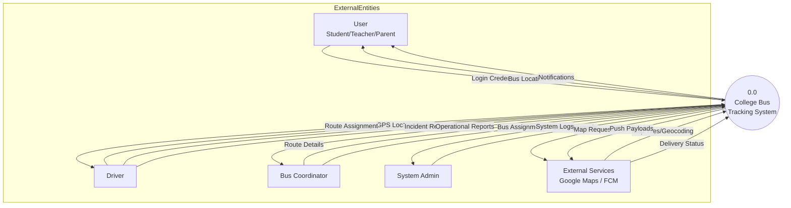

# DFD0: Context Diagram (Level 0)

**DFD ID:** DFD0  
**Level:** 0 (Context)  
**System:** College Bus Tracking System  
**Version:** 1.0  
**Date:** 2025-12-30

---

## 1. Purpose

The Context Diagram (Level 0 DFD) defines the boundaries of the College Bus Tracking System. It identifies the external entities that interact with the system and the high-level data flows into and out of the system, treating the entire application as a single "black box" process.

---

## 2. External Entities

| Entity                   | Role             | Description                                       |
| ------------------------ | ---------------- | ------------------------------------------------- |
| **User (Student/Staff)** | Primary Actor    | Consumes tracking data and notifications.         |
| **Driver**               | Primary Actor    | Provides live location data and trip status.      |
| **Coordinator**          | Admin Actor      | Manages routes, buses, and driver assignments.    |
| **Admin**                | Admin Actor      | Oversees the entire system and user approvals.    |
| **Google Maps API**      | External Service | Provides geospatial data and map rendering tiles. |
| **Firebase FCM**         | External Service | Delivers push notifications to mobile devices.    |

---

## 3. Mermaid Diagram

---

## 4. Data Flows

| Source      | Destination | Data Content                                         |
| ----------- | ----------- | ---------------------------------------------------- |
| Driver      | System      | Real-time GPS coordinates, trip start/end events     |
| Coordinator | System      | Bus details, route definitions, stop points          |
| System      | User        | Calculated ETA, live bus position, delay alerts      |
| System      | Services    | API requests for geocoding and notification dispatch |

---

## 5. Notes / Considerations

- **Scope Boundary:** The diagram clearly separates the core bus tracking logic from external providers like Google and Firebase.
- **Data Abstraction:** Individual requests (e.g., login, profile update) are aggregated into high-level flows.
- **Real-time Nature:** The "GPS Location" flow describes a continuous stream of data via WebSockets.
