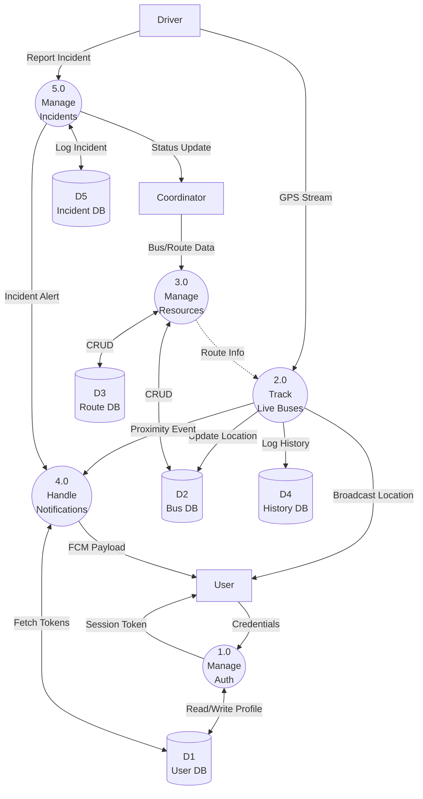

# DFD1: Main Processes (Level 1)

**DFD ID:** DFD1  
**Level:** 1  
**System:** College Bus Tracking System  
**Version:** 1.0  
**Date:** 2025-12-30

---

## 1. Purpose

The Level 1 DFD explodes the single "System" process from the Context Diagram into its major functional subprocesses. It illustrates how data moves between these core processes and the system's data stores.

---

## 2. Processes

| Process ID | Process Name         | Description                                                               |
| ---------- | -------------------- | ------------------------------------------------------------------------- |
| **1.0**    | Manage User Auth     | Handles registration, login, approval, and session management.            |
| **2.0**    | Track Live Buses     | Processes GPS streams, updates locations, and broadcasts to listeners.    |
| **3.0**    | Manage Resources     | Handles CRUD operations for buses, routes, and stops.                     |
| **4.0**    | Handle Notifications | Triggers and dispatches alerts for proximity, assignments, and incidents. |
| **5.0**    | Manage Incidents     | Processes incident reports and escalation workflows.                      |

---

## 3. Data Stores

| Store ID | Name        | Contents                                             |
| -------- | ----------- | ---------------------------------------------------- |
| **D1**   | User DB     | Profiles, credentials, roles, tokens.                |
| **D2**   | Bus DB      | Bus static data, current status, driver assignments. |
| **D3**   | Route DB    | Route paths, stop coordinates, schedules.            |
| **D4**   | History DB  | Trip logs, location history (time-series).           |
| **D5**   | Incident DB | Incident reports, investigation logs.                |

---

## 4. Mermaid Diagram

---

## 5. Notes / Considerations

- **Process Integration:** Process 2.0 (Tracking) provides real-time triggers to Process 4.0 (Notifications) for proximity alerts.
- **Data Persistence:** Location updates are transient in memory (Socket.IO) but periodically persisted to D4 (History DB) for analytics.
- **Access Control:** All processes implicitly interact with Process 1.0 (Auth) to validate permissions before execution.
