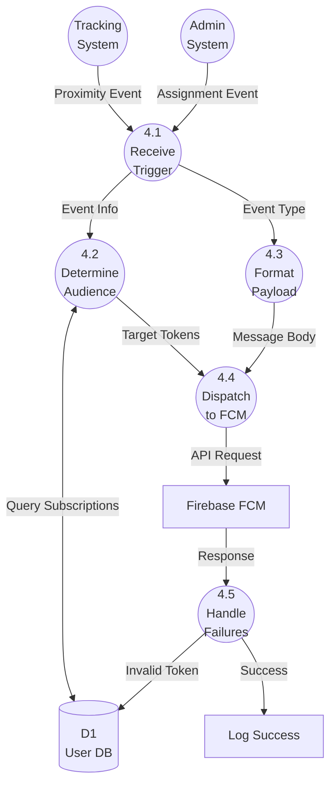

# DFD2: Handle Notifications (Level 2)

**DFD ID:** DFD4.0  
**Level:** 2 (Explosion of Process 4.0)  
**Process:** Handle Notifications  
**Version:** 1.0  
**Date:** 2025-12-30

---

## 1. Purpose

This Level 2 DFD details the "Handle Notifications" process, explaining how system triggers (proximity, assignment, incident) are transformed into target-specific push notifications via Firebase.

---

## 2. Processes

| Process ID | Process Name       | Description                                                                  |
| ---------- | ------------------ | ---------------------------------------------------------------------------- |
| **4.1**    | Receive Trigger    | Ingests events from other system processes (Tracking, Resources, Incidents). |
| **4.2**    | Determine Audience | Queries database to find which users (tokens) need to be notified.           |
| **4.3**    | Format Payload     | Constructs the specific title, body, and data payload for the message.       |
| **4.4**    | Dispatch to FCM    | Sends the formatted payload to Firebase Cloud Messaging API.                 |
| **4.5**    | Handle Failures    | Manages retries for failed deliveries or invalid tokens.                     |

---

## 3. Data Stores

| ID     | Name         | Contents                                                            |
| ------ | ------------ | ------------------------------------------------------------------- |
| **D1** | User DB      | FCM Tokens, Route Subscriptions.                                    |
| **D6** | Unsent Queue | Temporary store for failed messages involving non-transient errors. |

---

## 4. Mermaid Diagram

---

## 5. Notes / Considerations

- **Batching:** Process 4.4 may batch tokens for efficiency (multicast).
- **Token Management:** Process 4.5 is crucial for maintaining a clean D1 User DB by removing stale tokens (Invalid Token response).
- **Personalization:** Message content in 4.3 is localized based on user preference found in D1.
