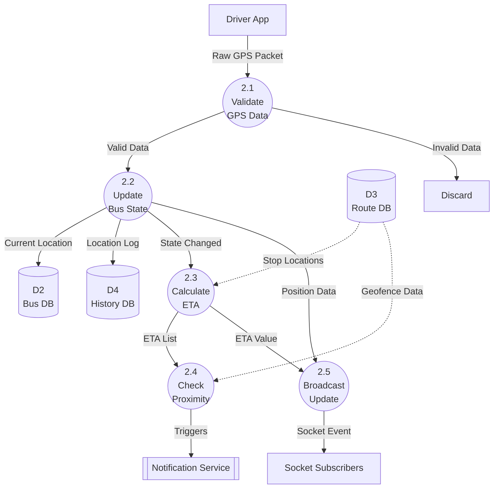

# DFD2: Track Live Buses (Level 2)

**DFD ID:** DFD2.0  
**Level:** 2 (Explosion of Process 2.0)  
**Process:** Track Live Buses  
**Version:** 1.0  
**Date:** 2025-12-30

---

## 1. Purpose

This Level 2 DFD details the internal data flows of the "Track Live Buses" process. It shows how raw GPS data from drivers is validated, processed for ETA calculations, broadcasted to users, and archived.

---

## 2. Processes

| Process ID | Process Name      | Description                                                         |
| ---------- | ----------------- | ------------------------------------------------------------------- |
| **2.1**    | Validate GPS Data | Checks for valid coordinates, timestamp, and active driver session. |
| **2.2**    | Update Bus State  | Updates the current location and heading in memory/database.        |
| **2.3**    | Calculate ETA     | Computes estimated arrival time for next stops based on distance.   |
| **2.4**    | Check Proximity   | Determines if the bus has entered a geofence (500m) of a stop.      |
| **2.5**    | Broadcast Update  | Emits the processed location event to subscribed socket rooms.      |

---

## 3. Data Stores & External

| ID        | Name           | Type                          |
| --------- | -------------- | ----------------------------- |
| **D2**    | Bus DB         | Data Store (Current State)    |
| **D3**    | Route DB       | Data Store (Stop Coordinates) |
| **D4**    | History DB     | Data Store (Archival)         |
| **Users** | Student/Parent | External Entity (Subscribers) |

---

## 4. Mermaid Diagram

---

## 5. Notes / Considerations

- **Latency:** Critical path (2.1 -> 2.2 -> 2.5) must occur in sub-second time for "real-time" feel.
- **Geofencing:** Process 2.4 compares current Lat/Lng against Stop Lat/Lng from D3 (Route DB).
- **Optimization:** ETA calculation (2.3) may be rate-limited (e.g., every 30s) rather than every GPS tick to save resources.
