# DEP1: Production Cloud Deployment

**Deployment Diagram ID:** DEP1  
**Scenario Name:** Production Cloud Deployment  
**Version:** 1.0  
**Date:** 2025-12-29

---

## 1. Purpose

This deployment diagram illustrates the production environment architecture, showing how the College Bus Tracking System is deployed across cloud infrastructure and end-user devices.

---

## 2. Nodes / Devices

| Node           | Type          | Description                         |
| -------------- | ------------- | ----------------------------------- |
| Android Device | Mobile        | Student/Teacher/Driver smartphones  |
| iOS Device     | Mobile        | Student/Teacher/Driver iPhones      |
| Cloud Server   | Cloud VM      | Hosts Node.js backend and Socket.IO |
| MongoDB Atlas  | Cloud DBaaS   | Managed database cluster            |
| Firebase       | Cloud Service | Push notification service           |
| Google Cloud   | Cloud Service | Maps and geocoding APIs             |

---

## 3. Software Components on Nodes

| Node           | Components                                       |
| -------------- | ------------------------------------------------ |
| Android Device | Flutter App (.apk), Google Maps SDK, FCM Client  |
| iOS Device     | Flutter App (.ipa), Google Maps SDK, APNs Client |
| Cloud Server   | Node.js Runtime, Express.js, Socket.IO Server    |
| MongoDB Atlas  | MongoDB Databases, Indexes                       |
| Firebase       | FCM Service, Admin SDK                           |
| Google Cloud   | Maps API, Geocoding API, Directions API          |

---

## 4. Mermaid Diagram

```mermaid
flowchart TB
    subgraph UserDevices["👥 User Devices"]
        subgraph Android["Android Devices"]
            AndroidStudent["📱 Student App\n(Flutter APK)"]
            AndroidDriver["📱 Driver App\n(Flutter APK)"]
        end
        subgraph iOS["iOS Devices"]
            iOSStudent["📱 Student App\n(Flutter IPA)"]
            iOSTeacher["📱 Teacher App\n(Flutter IPA)"]
        end
    end

    subgraph CloudInfra["☁️ Cloud Infrastructure"]
        subgraph AppServer["Application Server\n(Render/AWS/Heroku)"]
            NodeJS["⚙️ Node.js Runtime"]
            Express["🌐 Express.js API"]
            SocketIO["⚡ Socket.IO Server"]
        end
    end

    subgraph ManagedServices["🔧 Managed Services"]
        subgraph MongoDBAtlas["MongoDB Atlas"]
            Primary[("Primary Node")]
            Secondary1[("Secondary Node")]
            Secondary2[("Secondary Node")]
        end

        subgraph FirebaseCloud["Firebase"]
            FCM["🔔 Cloud Messaging"]
        end

        subgraph GoogleCloud["Google Cloud Platform"]
            MapsAPI["🗺️ Maps API"]
            GeoAPI["📍 Geocoding API"]
        end
    end

    AndroidStudent <--> Express
    AndroidDriver <--> Express
    iOSStudent <--> Express
    iOSTeacher <--> Express

    AndroidStudent <-.-> SocketIO
    AndroidDriver <-.-> SocketIO
    iOSStudent <-.-> SocketIO

    Express --> Primary
    SocketIO --> Primary
    Primary --> Secondary1
    Primary --> Secondary2

    Express --> FCM
    FCM --> AndroidStudent
    FCM --> iOSStudent

    AndroidStudent --> MapsAPI
    AndroidDriver --> MapsAPI
    iOSStudent --> MapsAPI
```

---

## 5. Actors / Roles

| Node                    | Interacting Roles   |
| ----------------------- | ------------------- |
| Android/iOS Student App | Students, Parents   |
| Android/iOS Teacher App | Teachers            |
| Android/iOS Driver App  | Drivers             |
| Cloud Server            | All roles (via API) |

---

## 6. Notes / Considerations

- **High Availability:** MongoDB Atlas uses replica set for redundancy.
- **Scaling:** Application server can be horizontally scaled behind load balancer.
- **Security:** All connections use TLS/SSL encryption.
- **CDN:** Static assets can be served via CDN for performance.
