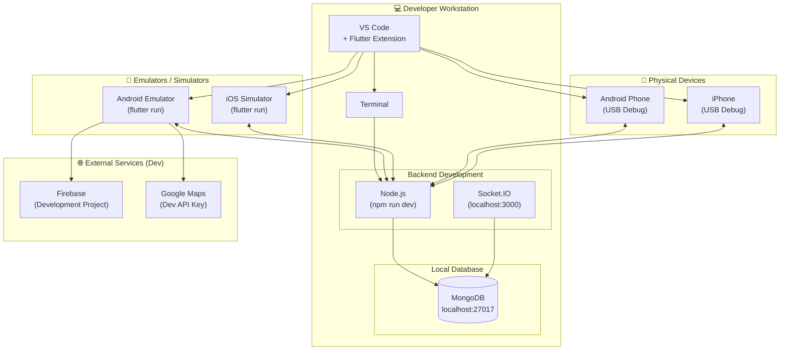

# DEP2: Development Environment

**Deployment Diagram ID:** DEP2  
**Scenario Name:** Development Environment  
**Version:** 1.0  
**Date:** 2025-12-29

---

## 1. Purpose

This deployment diagram illustrates the local development environment setup, showing how developers run and test the system on their workstations.

---

## 2. Nodes / Devices

| Node                  | Type    | Description                   |
| --------------------- | ------- | ----------------------------- |
| Developer Workstation | PC/Mac  | Development machine           |
| Android Emulator      | Virtual | Android device emulator       |
| iOS Simulator         | Virtual | iOS device simulator          |
| Physical Device       | Mobile  | Test device connected via USB |
| Local MongoDB         | Local   | Local database instance       |

---

## 3. Software Components on Nodes

| Node                  | Components                                    |
| --------------------- | --------------------------------------------- |
| Developer Workstation | VS Code, Node.js, Flutter SDK, Android Studio |
| Android Emulator      | Flutter Debug App, Chrome DevTools            |
| iOS Simulator         | Flutter Debug App                             |
| Physical Device       | Flutter Debug App (hot reload enabled)        |
| Local MongoDB         | MongoDB Community Server                      |

---

## 4. Mermaid Diagram

---

## 5. Actors / Roles

| Node                  | Developer Role                      |
| --------------------- | ----------------------------------- |
| Developer Workstation | Backend Developer, Mobile Developer |
| Emulators             | Testing and debugging               |
| Physical Devices      | Real device testing                 |

---

## 6. Notes / Considerations

- **Hot Reload:** Flutter enables instant code changes on emulators/devices.
- **Environment Variables:** `.env` file configures local vs production settings.
- **Port Configuration:** Backend runs on `localhost:3000`, MongoDB on `27017`.
- **Firebase:** Use separate Firebase project for development.
