# DEP3: Network Communication Paths

**Deployment Diagram ID:** DEP3  
**Scenario Name:** Network Communication Paths  
**Version:** 1.0  
**Date:** 2025-12-29

---

## 1. Purpose

This deployment diagram focuses on the network communication pathways, protocols, and data flow between all system components, emphasizing real-time communication architecture.

---

## 2. Nodes / Devices

| Node             | Type     | Communication Role       |
| ---------------- | -------- | ------------------------ |
| Mobile Devices   | Client   | HTTP/WebSocket initiator |
| Load Balancer    | Network  | Request distribution     |
| API Server       | Backend  | HTTP endpoint            |
| WebSocket Server | Backend  | Real-time events         |
| Database         | Storage  | Data persistence         |
| External APIs    | External | Third-party services     |

---

## 3. Communication Protocols

| Path            | Protocol | Port  | Purpose             |
| --------------- | -------- | ----- | ------------------- |
| Mobile → API    | HTTPS    | 443   | REST API calls      |
| Mobile ↔ Socket | WSS      | 443   | Real-time updates   |
| API → Database  | MongoDB  | 27017 | Data operations     |
| API → Firebase  | HTTPS    | 443   | Push notifications  |
| Mobile → Maps   | HTTPS    | 443   | Map tiles/geocoding |

---

## 4. Mermaid Diagram

```mermaid
flowchart TB
    subgraph Internet["🌐 Internet"]
        direction TB
    end

    subgraph MobileClients["📱 Mobile Clients"]
        StudentMobile["Student App"]
        DriverMobile["Driver App"]
        CoordMobile["Coordinator App"]
    end

    subgraph CloudNetwork["☁️ Cloud Network"]
        LB["⚖️ Load Balancer\n(SSL Termination)"]

        subgraph AppCluster["Application Cluster"]
            API1["API Server 1"]
            API2["API Server 2"]
            WS1["WebSocket Server 1"]
            WS2["WebSocket Server 2"]
        end

        Redis[("Redis\nSession Store")]
    end

    subgraph DataTier["🗄️ Data Tier"]
        MongoDB[("MongoDB Atlas\nReplica Set")]
    end

    subgraph ExternalAPIs["🔗 External APIs"]
        FCM["Firebase FCM"]
        GoogleMaps["Google Maps"]
    end

    StudentMobile -->|HTTPS| LB
    DriverMobile -->|HTTPS| LB
    CoordMobile -->|HTTPS| LB

    StudentMobile <-.->|WSS| LB
    DriverMobile <-.->|WSS| LB

    LB --> API1
    LB --> API2
    LB --> WS1
    LB --> WS2

    API1 --> MongoDB
    API2 --> MongoDB
    WS1 --> MongoDB
    WS2 --> MongoDB

    WS1 <--> Redis
    WS2 <--> Redis

    API1 -->|HTTPS| FCM
    API2 -->|HTTPS| FCM

    StudentMobile -->|HTTPS| GoogleMaps
    DriverMobile -->|HTTPS| GoogleMaps

    FCM -.->|Push| StudentMobile
    FCM -.->|Push| DriverMobile
```

---

## 5. Actors / Roles

| Communication Path   | Roles Involved                             |
| -------------------- | ------------------------------------------ |
| Mobile → API Server  | All roles                                  |
| Mobile ↔ WebSocket   | Driver (emit), Students/Teachers (receive) |
| FCM → Mobile         | All roles (notifications)                  |
| Mobile → Google Maps | All roles (map viewing)                    |

---

## 6. Notes / Considerations

- **SSL/TLS:** All external communication is encrypted.
- **WebSocket Scaling:** Redis pub/sub enables multi-server WebSocket synchronization.
- **Load Balancing:** Sticky sessions for WebSocket connections.
- **Firewall:** Only ports 443 (HTTPS/WSS) exposed publicly.
- **Rate Limiting:** API endpoints are rate-limited to prevent abuse.
- **Latency:** WebSocket provides <100ms latency for location updates.
