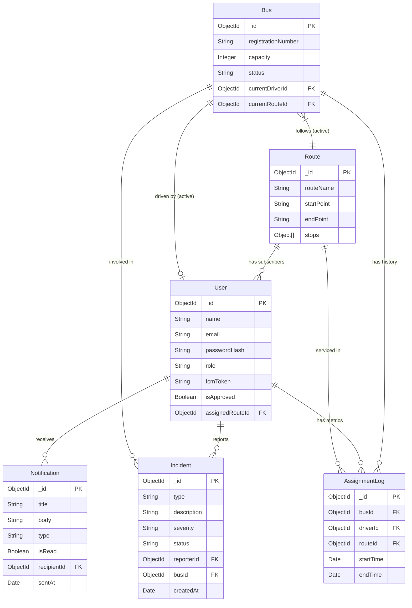

# ER Diagram: College Bus Tracking System

**Diagram ID:** ER_CBTS_01  
**System:** College Bus Tracking System  
**Version:** 2.0  
**Date:** 2025-12-30

---

## 1. Purpose

The Entity-Relationship (ER) Diagram provides a conceptual data model of the College Bus Tracking System. It defines the entities (objects) within the system, the attributes that describe them, and the relationships between these entities. This diagram serves as the blueprint for the MongoDB database schema design.

---

## 2. Entities

| Entity            | Description                                                                                           |
| ----------------- | ----------------------------------------------------------------------------------------------------- |
| **User**          | Represents all system users including Students, Teachers, Parents, Drivers, Coordinators, and Admins. |
| **Bus**           | Represents the physical vehicles in the fleet.                                                        |
| **Route**         | Defines the path a bus takes, including a sequence of stops.                                          |
| **Stop**          | A specific location (latitude/longitude) where the bus picks up or drops off passengers.              |
| **Incident**      | A report created by a driver or user regarding an issue or emergency.                                 |
| **Notification**  | A record of push notifications sent to users.                                                         |
| **BusAssignment** | A log or active state linking a Driver to a Bus and Route for a specific period.                      |

---

## 3. Attributes

### User

- **\_id** (PK): Unique Identifier
- **role**: Enum (Student, Teacher, Driver, Coordinator, Admin)
- **name**: String
- **email**: String (Unique)
- **passwordHash**: String
- **fcmToken**: String (for Push Notifications)
- **approvalStatus**: Boolean
- **assignedRouteId** (FK): Reference to User's primary route (optional)

### Bus

- **\_id** (PK): Unique Identifier
- **registrationNumber**: String (Unique)
- **capacity**: Integer
- **status**: Enum (Active, Maintenance, Retired)
- **currentDriverId** (FK): Reference to currently assigned Driver

### Route

- **\_id** (PK): Unique Identifier
- **name**: String (e.g., "Route 5 - Downtown")
- **stops**: Array of Stop Objects
- **schedule**: Object (Start Time, End Time)

### Incident

- **\_id** (PK): Unique Identifier
- **reporterId** (FK): User who reported
- **busId** (FK): Related Bus
- **type**: Enum (Breakdown, Delay, Emergency)
- **status**: Enum (Open, Investigating, Resolved)
- **createdAt**: Timestamp

---

## 4. Relationships

- **User (Student) ↔ Route**: Many-to-One (A student subscribes to one primary route).
- **Bus ↔ Driver**: One-to-One (Active Assignment) / One-to-Many (History).
- **Bus ↔ Route**: One-to-One (Active Trip) / Many-to-Many (Assignments over time).
- **User (Driver) ↔ Incident**: One-to-Many (A driver can report multiple incidents).
- **User ↔ Notification**: One-to-Many (A user receives multiple notifications).

---

## 5. Mermaid Diagram

---

## 6. Notes / Considerations

- **MongoDB Schema**: Since MongoDB is document-oriented, `Stop` entities are embedded directly within the `Route` document rather than being a separate collection, optimizing read performance for route details.
- **Polymorphism**: The `User` entity serves as a single collection for all roles to simplify authentication, with role-specific fields handled via schema flexibility or discriminators.
- **Real-time State**: The `currentDriverId` and `currentRouteId` on the `Bus` entity represent the _active_ state, updated in real-time via Socket.IO events.
