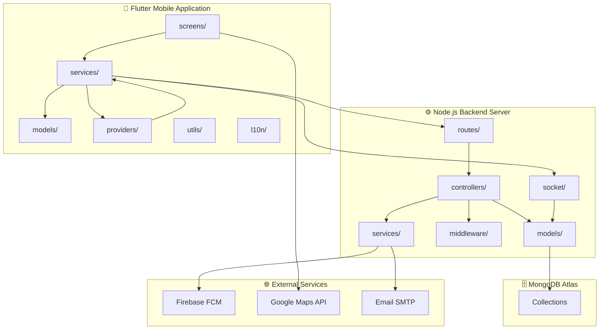

# PKG1: System Overview Package Diagram

**Package Diagram ID:** PKG1  
**Module Group:** System Overview  
**Version:** 1.0  
**Date:** 2025-12-30

---

## 1. Purpose

This package diagram provides a high-level view of the entire College Bus Tracking System architecture, showing the major subsystems and their dependencies across the mobile frontend, backend server, and external services.

---

## 2. Packages / Modules

| Package            | Description                                 |
| ------------------ | ------------------------------------------- |
| Flutter Mobile App | Cross-platform mobile application           |
| Node.js Backend    | Express-based REST API and WebSocket server |
| MongoDB Database   | Cloud-hosted document database              |
| External Services  | Third-party APIs and services               |

---

## 3. Mermaid Diagram

---

## 4. Dependencies

| Source Package | Target Package | Dependency Type    |
| -------------- | -------------- | ------------------ |
| Screens        | Services       | Uses               |
| Services       | Backend Routes | HTTP/REST          |
| Services       | Socket         | WebSocket          |
| Controllers    | Models         | Data Access        |
| Controllers    | Services       | Business Logic     |
| Models         | MongoDB        | Persistence        |
| Services       | Firebase       | Push Notifications |

---

## 5. Actors / Roles

| Package            | Interacting Roles                                                      |
| ------------------ | ---------------------------------------------------------------------- |
| Flutter Mobile App | All roles (Students, Teachers, Drivers, Parents, Coordinators, Admins) |
| Node.js Backend    | All roles (via API)                                                    |
| External Services  | All roles (notifications, maps)                                        |

---

## 6. Notes / Considerations

- **Separation of Concerns:** Clear boundaries between presentation, business logic, and data layers.
- **Scalability:** Backend can be horizontally scaled independent of mobile app.
- **External Dependencies:** System relies on Firebase, Google Maps, and SMTP services.
