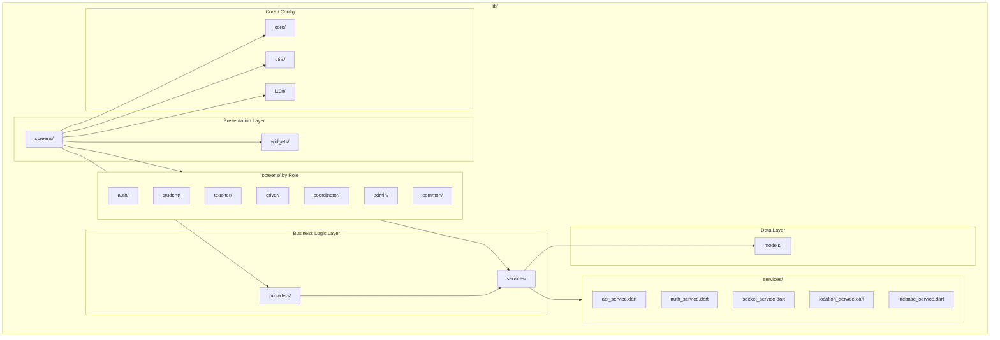

# PKG2: Flutter Mobile App Packages

**Package Diagram ID:** PKG2  
**Module Group:** Flutter Mobile Application  
**Version:** 1.0  
**Date:** 2025-12-30

---

## 1. Purpose

This package diagram details the internal package structure of the Flutter mobile application, showing how different modules are organized and their interdependencies.

---

## 2. Packages / Modules

| Package   | Path             | Description                          |
| --------- | ---------------- | ------------------------------------ |
| screens   | `lib/screens/`   | UI screens organized by role         |
| services  | `lib/services/`  | Business logic and API communication |
| models    | `lib/models/`    | Data transfer objects                |
| providers | `lib/providers/` | State management                     |
| utils     | `lib/utils/`     | Helper functions and constants       |
| widgets   | `lib/widgets/`   | Reusable UI components               |
| l10n      | `lib/l10n/`      | Localization resources               |
| core      | `lib/core/`      | Theme, routes, config                |

---

## 3. Mermaid Diagram

---

## 4. Dependencies

| Source Package | Target Package | Dependency Type |
| -------------- | -------------- | --------------- |
| screens        | providers      | State Access    |
| screens        | widgets        | UI Components   |
| providers      | services       | API Calls       |
| services       | models         | Data Mapping    |
| screens        | l10n           | Localization    |
| services       | core           | Configuration   |

---

## 5. Actors / Roles

| Package      | Interacting Roles           |
| ------------ | --------------------------- |
| auth/        | All roles (login, register) |
| student/     | Students, Parents           |
| teacher/     | Teachers                    |
| driver/      | Drivers                     |
| coordinator/ | Bus Coordinators            |
| admin/       | System Administrators       |

---

## 6. Notes / Considerations

- **Role-Based Organization:** Screens are organized by user role for clarity.
- **Service Abstraction:** All API calls go through service layer.
- **Localization:** Supports English, Hindi, and Telugu.
- **State Management:** Uses Provider pattern for reactive state.
