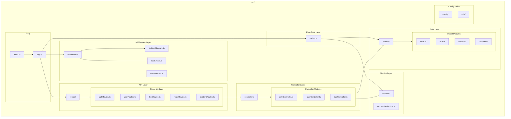

# PKG3: Node.js Backend Packages

**Package Diagram ID:** PKG3  
**Module Group:** Node.js Backend Server  
**Version:** 1.0  
**Date:** 2025-12-30

---

## 1. Purpose

This package diagram details the internal package structure of the Node.js backend server, showing the layered architecture and module dependencies.

---

## 2. Packages / Modules

| Package     | Path               | Description                      |
| ----------- | ------------------ | -------------------------------- |
| routes      | `src/routes/`      | Express route definitions        |
| controllers | `src/controllers/` | Request handlers                 |
| models      | `src/models/`      | Mongoose schemas                 |
| middleware  | `src/middleware/`  | Auth, validation, error handling |
| services    | `src/services/`    | External service integrations    |
| socket      | `src/socket.ts`    | Socket.IO event handlers         |
| config      | `src/config/`      | Environment configuration        |
| utils       | `src/utils/`       | Helper functions                 |

---

## 3. Mermaid Diagram

---

## 4. Dependencies

| Source Package | Target Package | Dependency Type  |
| -------------- | -------------- | ---------------- |
| index.ts       | app.ts         | Bootstrap        |
| routes         | controllers    | Request Handling |
| controllers    | models         | Data Access      |
| controllers    | services       | Business Logic   |
| middleware     | routes         | Request Pipeline |
| socket         | models         | Real-time Data   |

---

## 5. Actors / Roles

| Package    | Interacting Roles                          |
| ---------- | ------------------------------------------ |
| authRoutes | All roles                                  |
| userRoutes | Admin, Coordinator                         |
| busRoutes  | Coordinator, Driver                        |
| socket     | Driver (emit), Students/Teachers (receive) |

---

## 6. Notes / Considerations

- **Layered Architecture:** Clear separation between routes, controllers, and models.
- **Middleware Pipeline:** Auth → Rate Limit → Route Handler → Error Handler.
- **Real-Time:** Socket.IO runs alongside Express on same server.
- **TypeScript:** Full type safety across all modules.
