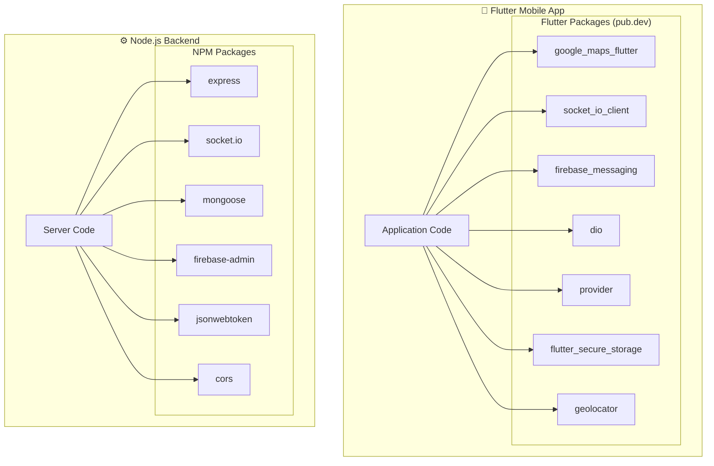

# PKG4: External Libraries & Dependencies

**Package Diagram ID:** PKG4  
**Module Group:** External Libraries  
**Version:** 1.0  
**Date:** 2025-12-30

---

## 1. Purpose

This package diagram illustrates the dependencies of the Mobile Application and Backend Server on external open-source libraries and SDKs, highlighting key technology choices.

---

## 2. Packages / Modules

| Package Group  | Environment  | Key Libraries                                                                      |
| -------------- | ------------ | ---------------------------------------------------------------------------------- |
| Mobile Clients | Flutter/Dart | `google_maps_flutter`, `socket_io_client`, `firebase_messaging`, `provider`, `dio` |
| Server Core    | Node.js      | `express`, `socket.io`, `mongoose`, `firebase-admin`                               |
| Utilities      | Shared       | `moment` / `intl` (Date handling), `bcrypt` (Security)                             |

---

## 3. Mermaid Diagram

---

## 4. Dependencies

| Library               | Usage                                           |
| --------------------- | ----------------------------------------------- |
| `google_maps_flutter` | Rendering maps and markers on mobile            |
| `socket_io_client`    | Real-time WebSocket client for location updates |
| `mongoose`            | ODM for MongoDB interaction                     |
| `firebase-admin`      | Sending push notifications from backend         |

---

## 5. Actors / Roles

| Component             | Role Interaction              |
| --------------------- | ----------------------------- |
| `geolocator`          | Driver (tracks location)      |
| `firebase_messaging`  | All Users (receives alerts)   |
| `google_maps_flutter` | All Users (views visual data) |

---

## 6. Notes / Considerations

- **Version Management:** defined in `pubspec.yaml` (Mobile) and `package.json` (Backend).
- **Security:** key libraries (`jsonwebtoken`, `flutter_secure_storage`) handle sensitive data.
