# Real-Time Architecture Diagram (Socket.io)

**Diagram ID:** RT_ARCH_01  
**System:** College Bus Tracking System  
**Version:** 1.0  
**Date:** 2025-12-30

---

## 1. Purpose

This diagram models the real-time event-driven architecture of the College Bus Tracking System. It specifically focuses on using **Socket.io** to enable bidirectional, low-latency communication for features such as live bus tracking, immediate incident alerts, and active driver assignment updates, bypassing the traditional request-response cycle of REST APIs.

---

## 2. Actors / Roles

- **Driver**: Emits high-frequency location updates (Broadcaster).
- **Student/Parent**: Receives location updates for their subscribed route (Subscribers).
- **Bus Coordinator**: Monitors all buses and receives incident alerts (Admin Subscriber).
- **System**: Processes events and manages room namespaces.

---

## 3. Real-Time Components

### Client-Side (Flutter)

- **Driver Client**: Uses `socket.io-client` to emit `locationUpdate` events every 3-5 seconds.
- **Student Client**: Joins specific `route_{id}` rooms to listen for `busLocation` events.
- **Admin Client**: Joins `admin_Global` room for system-wide alerts.

### Server-Side (Node.js)

- **Socket Manager**: Handles connection handshakes, authentication, and room management.
- **Event Handlers**: Specific logic for processing `updateLocation`, `newIncident`, etc.
- **Redis Adapter** (Conceptual): For scaling socket servers across multiple instances.

---

## 4. Mermaid Diagram

```mermaid
sequenceDiagram
    participant Driver as 🚌 Driver App
    participant Student as 📱 Student App
    participant Admin as 💻 Admin Portal
    participant SocketServer as ⚡ Socket.IO Server
    participant DB as 🗄️ MongoDB
    participant FCM as 🔔 Firebase Cloud Messaging

    Note over Driver, Admin: System Initialization & Handshake

    Driver->>SocketServer: Connect (Auth Token)
    SocketServer-->>Driver: Acknowledgement (SocketID assigned)
    Driver->>SocketServer: Join Room ("bus_101")

    Student->>SocketServer: Connect (Auth Token)
    SocketServer-->>Student: Acknowledgement
    Student->>SocketServer: Join Room ("route_5")

    Note over Driver, SocketServer: 📍 Continuous Location Stream (Every 3s)

    loop Live Tracking
        Driver->>SocketServer: emit('updateLocation', {lat, lng, heading})
        SocketServer->>SocketServer: Validate Data

        par Broadcast to Route Subscribers
            SocketServer-->>Student: emit('busLocation', {lat, lng})
        and Persist Async
            SocketServer->>DB: Update Bus Current Location
        end
    end

    Note over Driver, Admin: 🚨 incident Reporting Event

    Driver->>SocketServer: emit('reportIncident', {type: 'Breakdown'})
    SocketServer->>DB: Create Incident Record

    par Notify Admins
        SocketServer-->>Admin: emit('incidentAlert', {busId: '101'})
    and Push Notification
        SocketServer->>FCM: Send High Priority Notification
        FCM-->>Student: Push Notification ("Bus Breakdown")
    end
```

---

## 5. Event Flow Specifications

### Location Update Flow

1.  **Trigger**: Driver's GPS changes.
2.  **Emission**: `updateLocation` to Server.
3.  **Server Action**:
    - Broadcasts to `route_{id}` room users.
    - Updates `Bus` document in MongoDB (throttled).
    - Calculates proximity to next stop.

### Proximity Alert Flow (Server-Side Trigger)

1.  **Trigger**: Server detects Bus is < 500m from a Stop.
2.  **Action**: Server emits `stopApproaching` to `route_{id}` room.
3.  **Effect**: Student apps trigger a local vibration/alert.

---

## 6. Scalability & Latency Considerations

- **Latency**: Designed for < 200ms end-to-end latency for location updates.
- **Concurrency**: Socket.io handles thousands of concurrent connections using asynchronous I/O.
- **Throttling**: Database writes for location history are batched or throttled (e.g., once every 30s) to prevent DB saturation, while client updates remain real-time.
- **Heartbeats**: Ping/Pong mechanism ensures detection of disconnected drivers within seconds.
