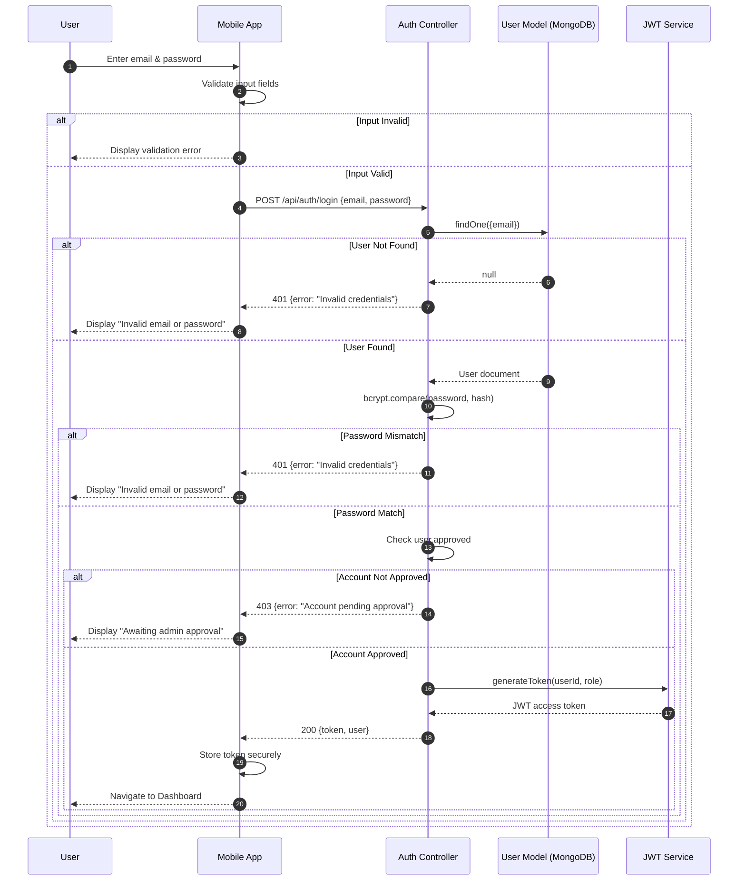

# SD1: User Authentication Flow

**Sequence Diagram ID:** SD1  
**Scenario Name:** User Authentication Flow  
**Version:** 1.0  
**Date:** 2025-12-29

---

## 1. Purpose

This sequence diagram illustrates the complete authentication flow for users (Student, Teacher, Driver, Admin) logging into the College Bus Tracking System. It shows the interaction between the mobile application, backend API, and database, including credential validation and JWT token generation.

---

## 2. Actors & Objects

| Participant    | Type     | Description                            |
| -------------- | -------- | -------------------------------------- |
| User           | Actor    | Any user attempting to login           |
| MobileApp      | System   | Flutter mobile application             |
| AuthController | Backend  | Express controller handling auth logic |
| UserModel      | Database | MongoDB User collection                |
| JWTService     | Service  | Token generation service               |

---

## 3. Mermaid Diagram

---

## 4. Alternative Flows / Exceptions

| Scenario           | Handling                                                           |
| ------------------ | ------------------------------------------------------------------ |
| Network Error      | MobileApp displays "Connection failed. Please try again."          |
| Server Error (500) | MobileApp displays generic error with retry option                 |
| Token Expired      | On subsequent API calls, 401 triggers logout and redirect to login |

---

## 5. Modules / Components Represented

| Component       | File/Location                                                          |
| --------------- | ---------------------------------------------------------------------- |
| Mobile App      | `lib/screens/auth/login_screen.dart`, `lib/services/auth_service.dart` |
| Auth Controller | `src/controllers/authController.ts`                                    |
| User Model      | `src/models/User.ts`                                                   |
| JWT Service     | `src/utils/jwt.ts`                                                     |

---

## 6. Notes / Considerations

- **Security:** Passwords are never transmitted in plain text after hashing. Bcrypt is used for password verification.
- **Token Storage:** JWT is stored using `flutter_secure_storage` for encrypted persistence.
- **Stateless Auth:** The backend uses stateless JWT authentication; no session is stored server-side.
