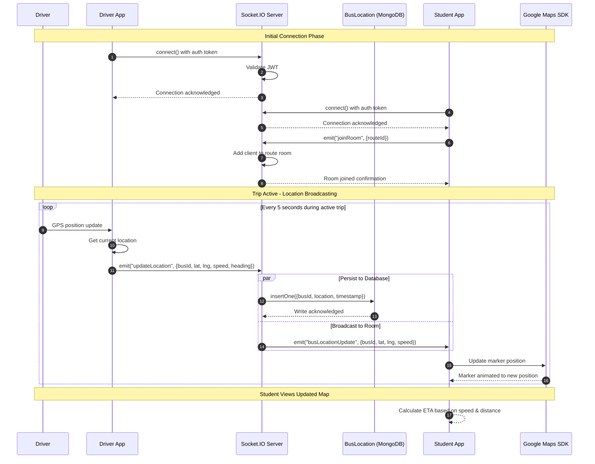

# SD2: Real-Time Bus Location Tracking

**Sequence Diagram ID:** SD2  
**Scenario Name:** Real-Time Bus Location Tracking  
**Version:** 1.0  
**Date:** 2025-12-29

---

## 1. Purpose

This sequence diagram models the core real-time functionality of the system: how a Driver's location is broadcast to subscribed Students/Teachers via WebSocket (Socket.IO). This is the most critical interaction pattern in the system, demonstrating bidirectional real-time communication.

---

## 2. Actors & Objects

| Participant  | Type     | Description                              |
| ------------ | -------- | ---------------------------------------- |
| Driver       | Actor    | Bus operator with active trip            |
| DriverApp    | System   | Driver's Flutter mobile app              |
| StudentApp   | System   | Student's Flutter mobile app             |
| SocketServer | Backend  | Socket.IO server integrated with Express |
| LocationDB   | Database | BusLocation collection in MongoDB        |
| GoogleMaps   | External | Google Maps SDK on client                |

---

## 3. Mermaid Diagram

---

## 4. Alternative Flows / Exceptions

| Scenario           | Handling                                                                                                 |
| ------------------ | -------------------------------------------------------------------------------------------------------- |
| Driver Disconnects | SocketServer emits "driverDisconnected" to room; StudentApp shows "Bus tracking temporarily unavailable" |
| Student Reconnects | On reconnect, StudentApp re-emits "joinRoom" to resubscribe                                              |
| High Latency       | Client-side interpolation smooths marker movement between updates                                        |

---

## 5. Modules / Components Represented

| Component      | File/Location                                                                    |
| -------------- | -------------------------------------------------------------------------------- |
| Driver App     | `lib/screens/driver/driver_dashboard.dart`, `lib/services/location_service.dart` |
| Student App    | `lib/screens/student/student_dashboard.dart`                                     |
| Socket Service | `lib/services/socket_service.dart`                                               |
| Socket Server  | `src/socket.ts`                                                                  |
| Location Model | `src/models/Bus.ts` (BusLocation)                                                |

---

## 6. Notes / Considerations

- **Real-Time Performance:** Location updates occur every 5 seconds to balance battery consumption and tracking accuracy.
- **Concurrency:** The `par` block shows parallel operations—database persistence and client broadcast happen concurrently.
- **Room-Based Routing:** Only students subscribed to a specific route receive updates, reducing unnecessary network traffic.
