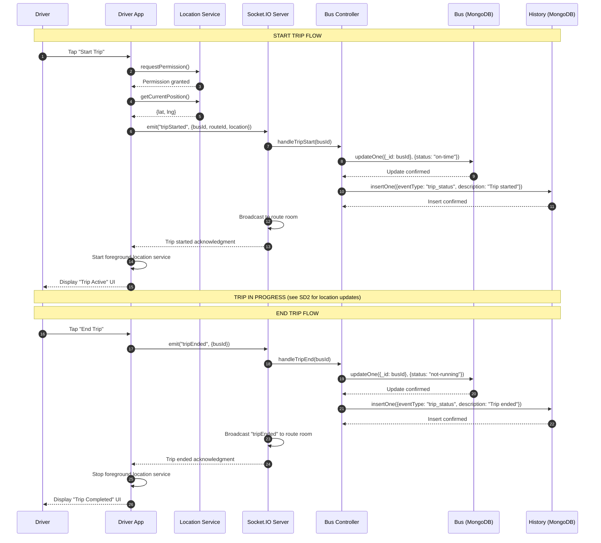

# SD3: Driver Trip Start and End

**Sequence Diagram ID:** SD3  
**Scenario Name:** Driver Trip Start and End  
**Version:** 1.0  
**Date:** 2025-12-29

---

## 1. Purpose

This sequence diagram details the lifecycle of a bus trip from the Driver's perspective. It covers starting a trip (which initiates location broadcasting) and ending a trip (which stops broadcasting and logs completion). This is essential for understanding the state transitions of the `Bus` entity.

---

## 2. Actors & Objects

| Participant     | Type     | Description                           |
| --------------- | -------- | ------------------------------------- |
| Driver          | Actor    | Bus operator                          |
| DriverApp       | System   | Driver's Flutter mobile app           |
| LocationService | Service  | Device GPS service                    |
| SocketServer    | Backend  | Socket.IO server                      |
| BusController   | Backend  | Express controller for bus operations |
| BusModel        | Database | Bus collection in MongoDB             |
| HistoryModel    | Database | History collection for logging        |

---

## 3. Mermaid Diagram

---

## 4. Alternative Flows / Exceptions

| Scenario                   | Handling                                                                 |
| -------------------------- | ------------------------------------------------------------------------ |
| Location Permission Denied | DriverApp prompts user to enable location in settings; trip cannot start |
| Network Disconnection      | DriverApp caches trip state; resumes broadcasting on reconnect           |
| App Crash During Trip      | Foreground service continues; on app restart, trip state is restored     |

---

## 5. Modules / Components Represented

| Component        | File/Location                              |
| ---------------- | ------------------------------------------ |
| Driver App       | `lib/screens/driver/driver_dashboard.dart` |
| Location Service | `lib/services/location_service.dart`       |
| Socket Service   | `lib/services/socket_service.dart`         |
| Socket Server    | `src/socket.ts`                            |
| Bus Controller   | `src/controllers/busController.ts`         |
| Bus Model        | `src/models/Bus.ts`                        |
| History Model    | `src/models/History.ts`                    |

---

## 6. Notes / Considerations

- **State Management:** `Bus.status` transitions: `not-running` → `on-time` → `not-running`.
- **Foreground Service:** Android requires a foreground service with notification for continuous location tracking.
- **Audit Logging:** Every trip start/end is logged in the `History` collection for operational analytics.
