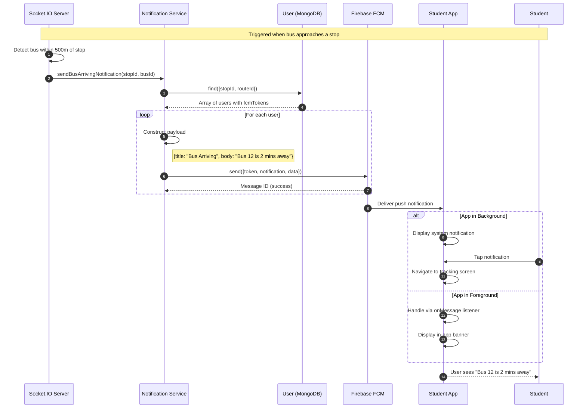

# SD4: Push Notification Delivery

**Sequence Diagram ID:** SD4  
**Scenario Name:** Push Notification Delivery  
**Version:** 1.0  
**Date:** 2025-12-29

---

## 1. Purpose

This sequence diagram illustrates how the backend triggers and delivers push notifications to mobile devices via Firebase Cloud Messaging (FCM). The example scenario is a "Bus Arriving" notification sent to students when a bus approaches their stop.

---

## 2. Actors & Objects

| Participant         | Type     | Description                                          |
| ------------------- | -------- | ---------------------------------------------------- |
| SocketServer        | Backend  | Receives location updates and triggers notifications |
| NotificationService | Service  | Constructs and sends FCM payloads                    |
| UserModel           | Database | Retrieves user FCM tokens                            |
| FirebaseFCM         | External | Google's push notification service                   |
| StudentApp          | System   | Student's mobile application                         |
| Student             | Actor    | Notification recipient                               |

---

## 3. Mermaid Diagram

---

## 4. Alternative Flows / Exceptions

| Scenario                        | Handling                                                                                |
| ------------------------------- | --------------------------------------------------------------------------------------- |
| Invalid FCM Token               | FCM returns error; NotificationService logs and may clear stale token from user profile |
| User Has Notifications Disabled | Notification not displayed; logged server-side                                          |
| Batch Sending                   | For large recipient lists, use FCM multicast or topic-based messaging                   |

---

## 5. Modules / Components Represented

| Component            | File/Location                                                                  |
| -------------------- | ------------------------------------------------------------------------------ |
| Socket Server        | `src/socket.ts`                                                                |
| Notification Service | `src/services/notificationService.ts`                                          |
| User Model           | `src/models/User.ts`                                                           |
| Firebase Config      | `src/config/firebase.ts`                                                       |
| Student App          | `lib/services/firebase_service.dart`, `lib/services/notification_service.dart` |

---

## 6. Notes / Considerations

- **Proximity Detection:** The trigger condition (500m) can be configured based on operational needs.
- **FCM Tokens:** Each device has a unique token; tokens may change and need periodic refresh.
- **Data Payload:** The `data` field allows the app to navigate to a specific screen when the notification is tapped.
