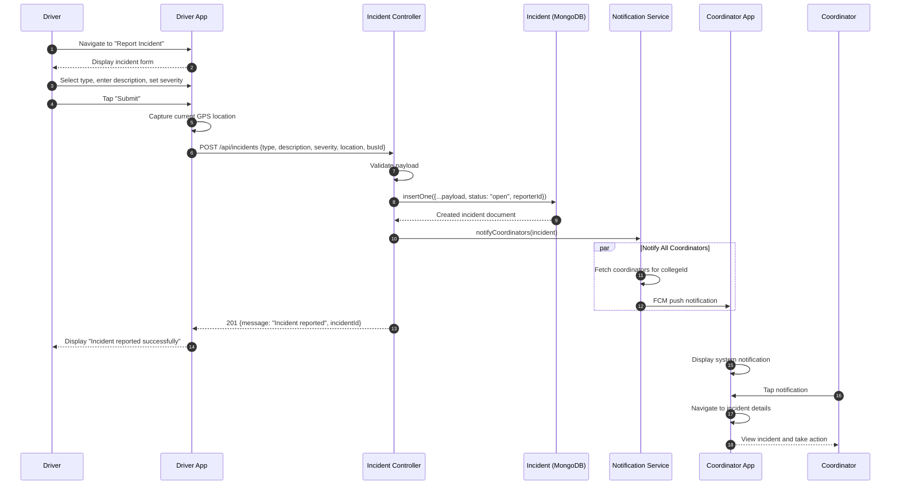

# SD5: Incident Reporting Flow

**Sequence Diagram ID:** SD5  
**Scenario Name:** Incident Reporting Flow  
**Version:** 1.0  
**Date:** 2025-12-29

---

## 1. Purpose

This sequence diagram models the workflow when a Driver (or Student) reports an incident through the mobile application. It covers incident submission, persistence, and immediate escalation via push notification to Coordinators.

---

## 2. Actors & Objects

| Participant         | Type     | Description                          |
| ------------------- | -------- | ------------------------------------ |
| Driver              | Actor    | User reporting the incident          |
| DriverApp           | System   | Driver's Flutter mobile app          |
| IncidentController  | Backend  | Express controller for incident CRUD |
| IncidentModel       | Database | Incident collection in MongoDB       |
| NotificationService | Service  | Sends alerts to Coordinators         |
| CoordinatorApp      | System   | Coordinator's mobile app             |
| Coordinator         | Actor    | Recipient of incident alert          |

---

## 3. Mermaid Diagram

---

## 4. Alternative Flows / Exceptions

| Scenario                      | Handling                                                                       |
| ----------------------------- | ------------------------------------------------------------------------------ |
| Location Unavailable          | Incident submitted without location; logged with `location: null`              |
| SOS Emergency                 | Pre-selects "Critical" severity; triggers immediate high-priority notification |
| Coordinator Resolves Incident | Updates `status` to "resolved"; Reporter receives notification                 |

---

## 5. Modules / Components Represented

| Component            | File/Location                                    |
| -------------------- | ------------------------------------------------ |
| Driver App           | `lib/screens/shared/report_incident_screen.dart` |
| Incident Controller  | `src/controllers/incidentController.ts`          |
| Incident Model       | `src/models/Incident.ts`                         |
| Notification Service | `src/services/notificationService.ts`            |
| Coordinator App      | `lib/screens/coordinator/`                       |

---

## 6. Notes / Considerations

- **Parallel Notification:** The `par` block indicates that notifications are sent to all coordinators concurrently.
- **Incident Lifecycle:** `status` transitions: `open` → `investigating` → `resolved`.
- **Priority Handling:** "Critical" incidents may trigger additional channels (SMS, email).
