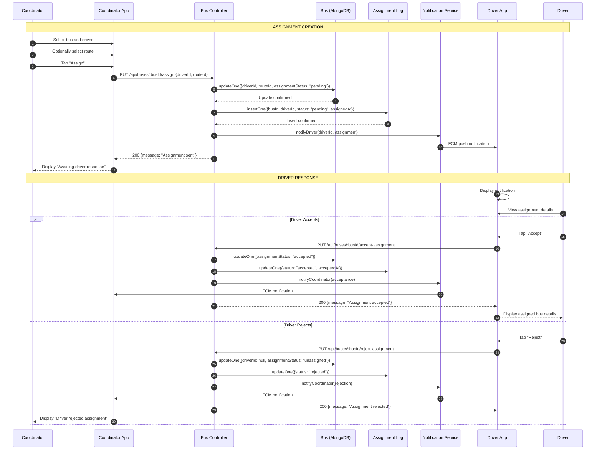

# SD6: Driver Assignment Workflow

**Sequence Diagram ID:** SD6  
**Scenario Name:** Driver Assignment Workflow  
**Version:** 1.0  
**Date:** 2025-12-29

---

## 1. Purpose

This sequence diagram models the complete workflow when a Coordinator assigns a Driver to a Bus. It includes the assignment creation, notification to the Driver, and the Driver's acceptance or rejection response. This demonstrates a multi-actor, asynchronous workflow.

---

## 2. Actors & Objects

| Participant         | Type     | Description                 |
| ------------------- | -------- | --------------------------- |
| Coordinator         | Actor    | Admin assigning the driver  |
| CoordinatorApp      | System   | Coordinator's mobile app    |
| BusController       | Backend  | Handles assignment logic    |
| BusModel            | Database | Bus collection              |
| AssignmentLog       | Database | BusAssignmentLog collection |
| NotificationService | Service  | Sends FCM notifications     |
| DriverApp           | System   | Driver's mobile app         |
| Driver              | Actor    | User receiving assignment   |

---

## 3. Mermaid Diagram

---

## 4. Alternative Flows / Exceptions

| Scenario                | Handling                                                                              |
| ----------------------- | ------------------------------------------------------------------------------------- |
| Assignment Timeout      | If driver doesn't respond within X hours, system may auto-reject or alert coordinator |
| Reassignment            | Coordinator can cancel pending assignment and assign to a different driver            |
| Driver Already Assigned | System warns if driver has an existing active assignment                              |

---

## 5. Modules / Components Represented

| Component            | File/Location                              |
| -------------------- | ------------------------------------------ |
| Coordinator App      | `lib/screens/coordinator/`                 |
| Bus Controller       | `src/controllers/busController.ts`         |
| Bus Model            | `src/models/Bus.ts`                        |
| Assignment Log       | `src/models/BusAssignmentLog.ts`           |
| Notification Service | `src/services/notificationService.ts`      |
| Driver App           | `lib/screens/driver/driver_dashboard.dart` |

---

## 6. Notes / Considerations

- **Asynchronous Workflow:** This is a long-lived interaction; the driver may respond hours after assignment.
- **State Tracking:** `assignmentStatus` on `Bus` provides current state; `BusAssignmentLog` provides audit history.
- **Bidirectional Notifications:** Both parties (Coordinator and Driver) receive feedback on actions.
