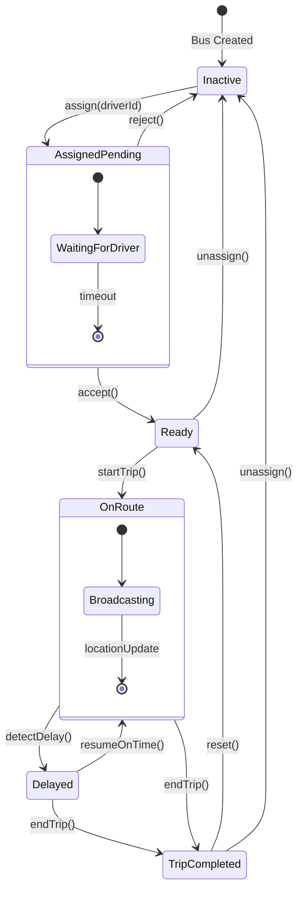

# SM1: Bus Entity State Machine

**State Machine ID:** SM1  
**Entity Name:** Bus  
**Version:** 1.0  
**Date:** 2025-12-29

---

## 1. Purpose

This state machine diagram models the operational lifecycle of a Bus entity in the College Bus Tracking System. The Bus transitions through various states based on driver assignments, trip activity, and operational conditions. Understanding these states is critical for tracking system logic and UI display.

---

## 2. States & Transitions

| State                  | Description                                                       |
| ---------------------- | ----------------------------------------------------------------- |
| **Inactive**           | Bus exists in the system but is not assigned to any driver.       |
| **Assigned (Pending)** | Bus is assigned to a driver, awaiting driver acceptance.          |
| **Ready**              | Driver has accepted the assignment; bus is ready to start a trip. |
| **On Route (Active)**  | Trip is in progress; location is being broadcast in real-time.    |
| **Delayed**            | Bus is running behind schedule (detected via ETA algorithms).     |
| **Trip Completed**     | Trip has ended; bus is idle until next assignment or trip.        |

| Transition   | From State             | To State           | Trigger Event               |
| ------------ | ---------------------- | ------------------ | --------------------------- |
| assign       | Inactive               | Assigned (Pending) | Coordinator assigns driver  |
| accept       | Assigned (Pending)     | Ready              | Driver accepts assignment   |
| reject       | Assigned (Pending)     | Inactive           | Driver rejects assignment   |
| startTrip    | Ready                  | On Route           | Driver taps "Start Trip"    |
| detectDelay  | On Route               | Delayed            | ETA exceeds scheduled time  |
| resumeOnTime | Delayed                | On Route           | Bus catches up to schedule  |
| endTrip      | On Route / Delayed     | Trip Completed     | Driver taps "End Trip"      |
| reset        | Trip Completed         | Ready              | Bus available for next trip |
| unassign     | Ready / Trip Completed | Inactive           | Coordinator removes driver  |

---

## 3. Mermaid Diagram

---

## 4. Actors / Components

| Actor / Component           | Role in State Transitions                           |
| --------------------------- | --------------------------------------------------- |
| **Coordinator App**         | Triggers `assign`, `unassign`                       |
| **Driver App**              | Triggers `accept`, `reject`, `startTrip`, `endTrip` |
| **Backend (Socket.IO)**     | Monitors and broadcasts state changes               |
| **Delay Detection Service** | Triggers `detectDelay`, `resumeOnTime`              |

---

## 5. Notes / Considerations

- **Real-Time Updates:** State changes are broadcast via Socket.IO to all subscribed clients.
- **Database Field:** `Bus.status` maps to: `not-running` (Inactive, Ready, Trip Completed), `on-time` (On Route), `delayed` (Delayed).
- **Compound State:** `OnRoute` contains internal behavior (location broadcasting) modeled as a nested state.
