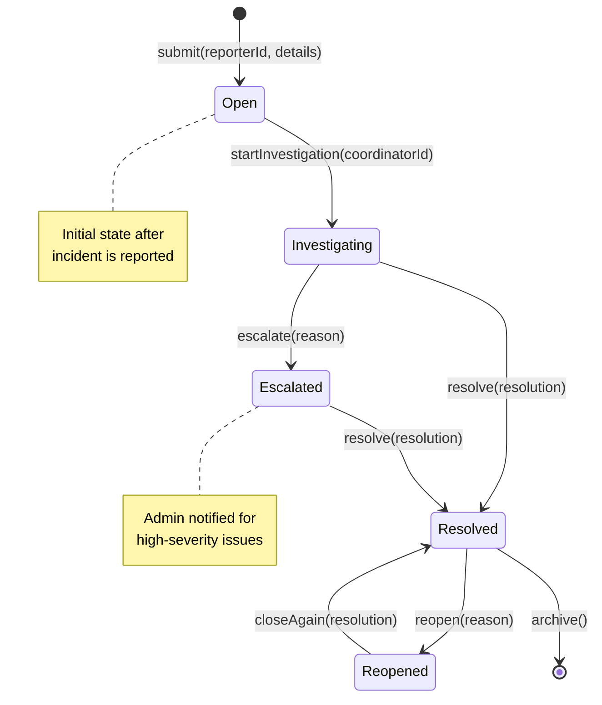

# SM2: Incident Entity State Machine

**State Machine ID:** SM2  
**Entity Name:** Incident  
**Version:** 1.0  
**Date:** 2025-12-29

---

## 1. Purpose

This state machine diagram models the lifecycle of an Incident report in the College Bus Tracking System. Incidents progress through stages from initial report to resolution, enabling proper tracking and escalation by Coordinators and Admins.

---

## 2. States & Transitions

| State             | Description                                                          |
| ----------------- | -------------------------------------------------------------------- |
| **Open**          | Incident has been reported and is awaiting review.                   |
| **Investigating** | Coordinator is actively reviewing and addressing the incident.       |
| **Escalated**     | Incident has been escalated to higher authority (Admin).             |
| **Resolved**      | Incident has been addressed and closed.                              |
| **Reopened**      | A previously resolved incident has been reopened for further action. |

| Transition         | From State                | To State      | Trigger Event                      |
| ------------------ | ------------------------- | ------------- | ---------------------------------- |
| submit             | [Initial]                 | Open          | User submits incident report       |
| startInvestigation | Open                      | Investigating | Coordinator picks up the case      |
| escalate           | Investigating             | Escalated     | Issue requires admin intervention  |
| resolve            | Investigating / Escalated | Resolved      | Issue is addressed                 |
| reopen             | Resolved                  | Reopened      | New information or recurring issue |
| closeAgain         | Reopened                  | Resolved      | Issue re-resolved                  |

---

## 3. Mermaid Diagram

---

## 4. Actors / Components

| Actor / Component        | Role in State Transitions                             |
| ------------------------ | ----------------------------------------------------- |
| **Driver / Student App** | Triggers `submit` (report incident)                   |
| **Coordinator App**      | Triggers `startInvestigation`, `escalate`, `resolve`  |
| **Admin App**            | Handles `escalate`, `resolve` for escalated incidents |
| **Notification Service** | Sends alerts on state changes                         |

---

## 5. Notes / Considerations

- **Severity Impact:** Critical incidents may auto-escalate to `Escalated` state.
- **Audit Trail:** All state transitions are logged in the `History` collection with timestamps.
- **Database Field:** `Incident.status` maps directly to these states: `open`, `investigating`, `resolved`.
