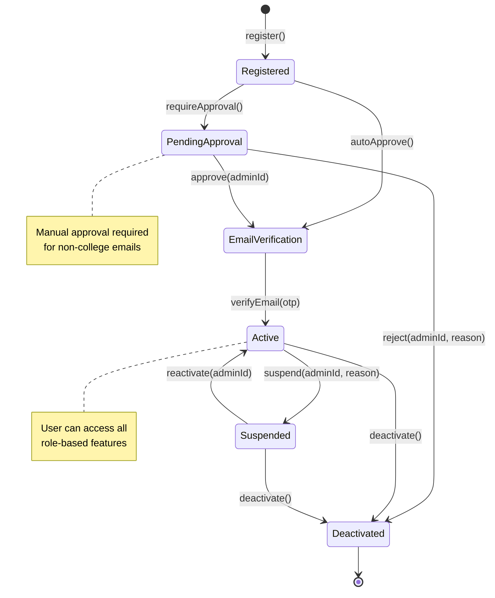

# SM3: User Account State Machine

**State Machine ID:** SM3  
**Entity Name:** User Account  
**Version:** 1.0  
**Date:** 2025-12-29

---

## 1. Purpose

This state machine diagram models the lifecycle of a User Account from registration to active usage. It covers the approval workflow, email verification, and account status changes relevant to access control.

---

## 2. States & Transitions

| State                  | Description                                                            |
| ---------------------- | ---------------------------------------------------------------------- |
| **Registered**         | User has submitted registration; account exists but is not yet usable. |
| **Pending Approval**   | Account requires manual admin approval.                                |
| **Email Verification** | Awaiting user to verify email via OTP or link.                         |
| **Active**             | Account is fully approved and verified; user can log in.               |
| **Suspended**          | Account has been temporarily disabled by admin.                        |
| **Deactivated**        | Account is permanently deactivated.                                    |

| Transition      | From State         | To State           | Trigger Event                    |
| --------------- | ------------------ | ------------------ | -------------------------------- |
| register        | [Initial]          | Registered         | User submits registration form   |
| requireApproval | Registered         | Pending Approval   | Email domain not in allowed list |
| autoApprove     | Registered         | Email Verification | Email domain is allowed          |
| approve         | Pending Approval   | Email Verification | Admin approves account           |
| reject          | Pending Approval   | Deactivated        | Admin rejects account            |
| verifyEmail     | Email Verification | Active             | User verifies email via OTP      |
| suspend         | Active             | Suspended          | Admin suspends account           |
| reactivate      | Suspended          | Active             | Admin reactivates account        |
| deactivate      | Active / Suspended | Deactivated        | Admin deactivates account        |

---

## 3. Mermaid Diagram

---

## 4. Actors / Components

| Actor / Component    | Role in State Transitions                                           |
| -------------------- | ------------------------------------------------------------------- |
| **User (All Roles)** | Triggers `register`, `verifyEmail`                                  |
| **Auth Controller**  | Evaluates `autoApprove` vs `requireApproval`                        |
| **Admin App**        | Triggers `approve`, `reject`, `suspend`, `reactivate`, `deactivate` |
| **OTP Service**      | Validates `verifyEmail` transition                                  |

---

## 5. Notes / Considerations

- **Auto-Approval Logic:** If the user's email domain matches `College.allowedDomains`, the account bypasses manual approval.
- **Database Fields:** `User.approved` and `User.emailVerified` flags track these states.
- **Security:** Only `Active` accounts can successfully authenticate via the login flow.
