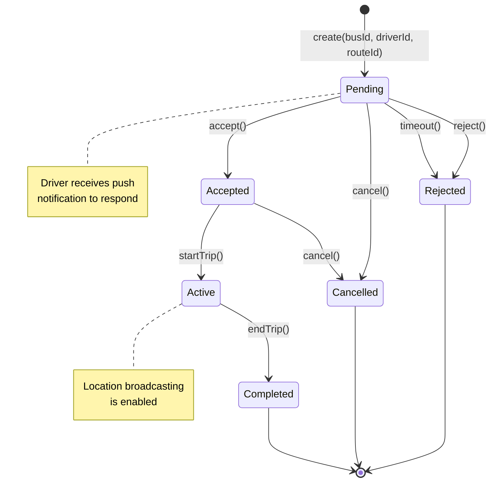

# SM4: Bus Assignment State Machine

**State Machine ID:** SM4  
**Entity Name:** Bus Assignment (BusAssignmentLog)  
**Version:** 1.0  
**Date:** 2025-12-29

---

## 1. Purpose

This state machine diagram models the lifecycle of a Bus Assignment from the moment a Coordinator assigns a driver to a bus until the assignment is completed or terminated. This is distinct from the Bus entity state and focuses specifically on the assignment workflow.

---

## 2. States & Transitions

| State         | Description                                                |
| ------------- | ---------------------------------------------------------- |
| **Pending**   | Assignment created; awaiting driver response.              |
| **Accepted**  | Driver has accepted the assignment.                        |
| **Rejected**  | Driver has declined the assignment.                        |
| **Active**    | Driver is actively operating the bus on an assigned route. |
| **Completed** | Assignment fulfilled; trip(s) completed successfully.      |
| **Cancelled** | Assignment cancelled by Coordinator before completion.     |

| Transition | From State         | To State  | Trigger Event                     |
| ---------- | ------------------ | --------- | --------------------------------- |
| create     | [Initial]          | Pending   | Coordinator assigns driver to bus |
| accept     | Pending            | Accepted  | Driver accepts assignment         |
| reject     | Pending            | Rejected  | Driver rejects assignment         |
| startTrip  | Accepted           | Active    | Driver begins trip                |
| endTrip    | Active             | Completed | Driver ends trip / shift          |
| cancel     | Pending / Accepted | Cancelled | Coordinator cancels assignment    |
| timeout    | Pending            | Rejected  | No response within time limit     |

---

## 3. Mermaid Diagram

---

## 4. Actors / Components

| Actor / Component        | Role in State Transitions                           |
| ------------------------ | --------------------------------------------------- |
| **Coordinator App**      | Triggers `create`, `cancel`                         |
| **Driver App**           | Triggers `accept`, `reject`, `startTrip`, `endTrip` |
| **Timeout Service**      | Triggers `timeout` after configured duration        |
| **Notification Service** | Sends alerts on all transitions                     |

---

## 5. Notes / Considerations

- **Database Model:** `BusAssignmentLog` tracks these states with timestamps (`assignedAt`, `acceptedAt`, `completedAt`).
- **Timeout Configuration:** Default timeout is configurable (e.g., 2 hours for driver response).
- **Historical Data:** Completed and Cancelled assignments remain in the database for audit purposes.
