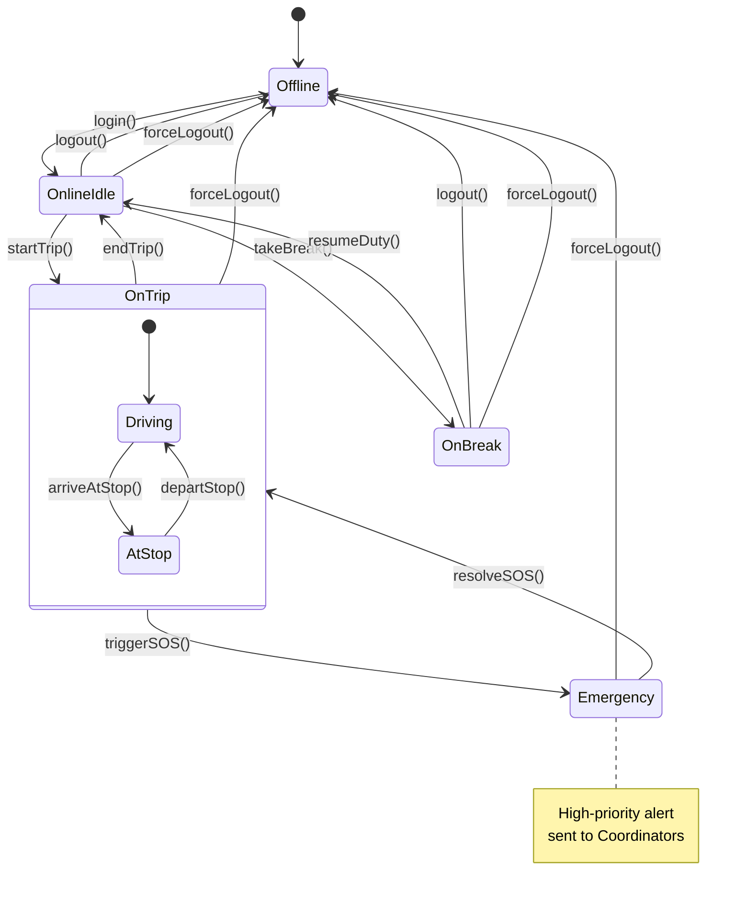

# SM5: Driver Session State Machine

**State Machine ID:** SM5  
**Entity Name:** Driver Session  
**Version:** 1.0  
**Date:** 2025-12-29

---

## 1. Purpose

This state machine diagram models the operational session states of a Driver during their workday. It tracks from login through active duty (on/off trip) to logout, representing the driver's availability and activity status.

---

## 2. States & Transitions

| State             | Description                                     |
| ----------------- | ----------------------------------------------- |
| **Offline**       | Driver is not logged into the application.      |
| **Online (Idle)** | Driver is logged in but not on an active trip.  |
| **On Trip**       | Driver is actively operating a bus trip.        |
| **On Break**      | Driver is temporarily unavailable (break time). |
| **Emergency**     | Driver has triggered an SOS alert.              |

| Transition  | From State               | To State      | Trigger Event                  |
| ----------- | ------------------------ | ------------- | ------------------------------ |
| login       | Offline                  | Online (Idle) | Driver logs into app           |
| logout      | Online (Idle) / On Break | Offline       | Driver logs out                |
| startTrip   | Online (Idle)            | On Trip       | Driver starts a trip           |
| endTrip     | On Trip                  | Online (Idle) | Driver ends the trip           |
| takeBreak   | Online (Idle)            | On Break      | Driver goes on break           |
| resumeDuty  | On Break                 | Online (Idle) | Driver returns from break      |
| triggerSOS  | On Trip                  | Emergency     | Driver triggers SOS button     |
| resolveSOS  | Emergency                | On Trip       | Coordinator resolves emergency |
| forceLogout | Any                      | Offline       | Admin forces logout            |

---

## 3. Mermaid Diagram

---

## 4. Actors / Components

| Actor / Component    | Role in State Transitions                                                                   |
| -------------------- | ------------------------------------------------------------------------------------------- |
| **Driver App**       | Triggers `login`, `logout`, `startTrip`, `endTrip`, `takeBreak`, `resumeDuty`, `triggerSOS` |
| **Admin App**        | Triggers `forceLogout`                                                                      |
| **Coordinator App**  | Triggers `resolveSOS`                                                                       |
| **Socket.IO Server** | Tracks real-time session state                                                              |

---

## 5. Notes / Considerations

- **Session Tracking:** The backend maintains driver session state via Socket.IO connection status.
- **Nested State:** `OnTrip` has internal sub-states for finer tracking (Driving, AtStop).
- **SOS Handling:** Emergency state triggers immediate high-priority notifications to all coordinators.
